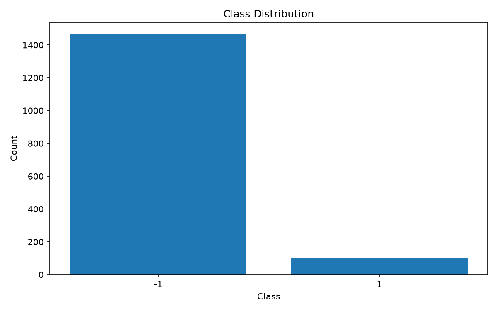

# WaferGuard

> 전처리 에이전트·센서 기반 머신러닝·웨이퍼맵 딥러닝으로 구성하는 반도체 품질 분석 프로토타입

[프로젝트 문서](docs/README.md) · [에이전트·WM-811K 설계](docs/WM811K/WM811K_BASIC_DESIGN.md) · [SECOM 결과](reports/README.md#secom-공개-결과-요약) · [SECOM Model Card](docs/secom/model_card_v2.md)

## 프로젝트 소개

공정 센서의 불량 위험 선별과 검사 결과 웨이퍼맵의 결함 패턴 진단을 함께 다루는 프로젝트입니다. 전처리 에이전트가 데이터 준비 작업을 관리하고, 머신러닝과 딥러닝은 서로 다른 입력·정답·평가 기준으로 검증합니다.

## 세 가지 구성 요소

| 영역 | 역할 | 담당 | 현재 상태 |
| --- | --- | --- | --- |
| 전처리 에이전트 | WM-811K 수집·품질 검사·Lot 분할·변환·입력 계약 검증의 실행과 기록 관리 | 양현승 | 설계 단계 |
| SECOM 머신러닝 | 공정 센서로 불량 위험 선별, 핵심 센서 20개 선택, OOF 문턱 비교·저장·추론 | ML: 양현승 / 데이터·EDA: 이종수 | V2 실험·저장·복원·기존 Test 비교 완료 |
| WM-811K 딥러닝 | 검사 결과 맵의 9종 패턴 분류, 작은 CNN·ResNet18 비교, 클래스별 오류 분석 | 이종수 | 설계 단계 |

에이전트는 설정으로 정한 전처리 코드를 실행·관리하는 역할입니다. 라벨·split·변환 기준을 임의로 바꾸거나 모델 판정을 대신하지 않습니다. 기존 SECOM 전처리는 에이전트 없이 실행할 수 있으며, 현재 에이전트의 구현 범위는 WM-811K 맵 전처리로 계획되어 있습니다.

```text
SECOM 센서 → 기존 전처리 Pipeline → ML 위험 선별 → SECOM 평가 결과
WM-811K 맵 → 전처리 에이전트 → CNN / ResNet18 패턴 분류 → WM 평가 결과

각 과제의 평가 결과 → 공통 보고서 (데이터·성능은 별도 표시)
```

두 데이터셋에는 동일 웨이퍼 대응 관계가 없으므로 **독립 학습·평가**를 수행합니다. 향후 `센서 위험 선별 → 검사맵 확보 가정 → 패턴 진단` 연결은 가상 흐름 데모이며 실제 통합 검출 성능을 뜻하지 않습니다. WM-811K는 광학 사진이 아닌 다이별 검사 결과 맵이고, `None` 패턴도 최종 양품 판정과 같지 않습니다.

## SECOM 구현과 핵심 결과

UCI SECOM의 **1,567개 표본·590개 센서·불량 104건**으로 불균형 이진 분류를 수행했습니다. 높은 정확도보다 불량 미검, 시간 변화에 대한 검증, 센서 축소와 재현 가능한 Pipeline에 초점을 둡니다.

- 결측률 50% 초과·상수 센서를 학습 fold 안에서 제거하고 개수를 기록합니다.
- 결측 처리·스케일링·특징 선택을 Pipeline 안에서 학습해 데이터 누수를 방지합니다.
- 반복 교차검증과 시간순 검증으로 모델·전처리·센서 선택 방법을 비교합니다.
- 고정 센서 20개와 저장된 학습 통계만으로 예측하고, 저장·복원 정합성을 검증합니다.

연구용 주후보는 **반복 weighted gain Top-20 + XGBoost(깊이 2, 규제 1)**입니다.

### 센서 축소 비교

| 후보 | 시간순 3구간 평균 AP | 표준편차 | 평균 ROC-AUC |
| --- | ---: | ---: | ---: |
| 품질 필터 후 전체 센서 | 0.174873 | 0.133225 | 0.600997 |
| 구간별 재선택 Top-20 | 0.171439 | 0.050729 | 0.620441 |

AP 상대 하락은 **1.96%**입니다. 전체 모델은 깊이 3, Top-20은 깊이 2이므로 센서 수와 모델 설정을 함께 변경한 후보 비교입니다. 아래 저장된 고정 센서 모델의 성능과는 평가 범위가 다릅니다.

### 고정 센서 20개 모델

두 후보는 센서·학습 통계·분류기를 공유하며, 과거 OOF에서 선택한 문턱만 다릅니다. **이후 개발 구간 272행·불량 9건**의 결과입니다.

| OOF Recall 목표 | 이후 Recall | 위험 대상 선별 비율 | TP / FP / FN / TN |
| --- | ---: | ---: | --- |
| 90% — 미검 우선 | 100.00% | 94.49% | 9 / 248 / 0 / 15 |
| 80% — 부담 비교 | 88.89% | 50.37% | 8 / 129 / 1 / 134 |

두 시나리오의 AP는 **0.323619**, ROC-AUC는 **0.795944**입니다. 저장·복원 검증 33행에서 최대 확률 차이는 0.0이었고 확률·판정·라벨이 일치했습니다. 이 검증은 탐지 성능 평가가 아닙니다.

독립 최종 Test 결과나 미래 검출률 보장이 아니며, 높은 Recall과 함께 많은 정상 표본도 선별됩니다. 정확한 문턱·집계값·평가 범위는 [공개 결과 요약](reports/README.md#secom-공개-결과-요약), 선택 과정과 과거 V1 결과는 [실험 요약](docs/secom/SECOM_ML_SUMMARY.md)과 [보고서](docs/secom/report.md)에 기록했습니다.

### 기존 Test에서 V1·V2 비교 — ML 실험 마무리

저장된 V2를 **V1과 동일한 Test 236행·불량 9건**에서 재학습·문턱 조절 없이 평가했습니다. 위 개발 구간 272행의 결과와 구분합니다.

| 후보 | Recall | 위험 대상 선별 비율 | TP / FP / FN / TN |
| --- | ---: | ---: | --- |
| V1 | 11.11% | 13.14% | 1 / 30 / 8 / 197 |
| V2 — OOF 목표 90% | 100.00% | 94.92% | 9 / 215 / 0 / 12 |
| V2 — OOF 목표 80% | 66.67% | 46.19% | 6 / 103 / 3 / 124 |

AP는 V1 **0.040461 → V2 0.075077**, ROC-AUC는 **0.488008 → 0.682330**으로 개선됐습니다. 다만 90% 시나리오는 거의 전부를 선별하고, 80% 시나리오는 Test Recall 목표에 미달했습니다. V1의 평가 결과를 참고한 개발 이력이 있어 완전 미사용 독립 Test로 주장하지 않습니다.

동일 학습 범위·XGBoost 설정의 전체 센서 444개 기준도 같은 Test에서 비교했습니다. AP는 전체 **0.065251**, 고정 Top-20 **0.075077**입니다. Top-20은 검출 건수가 많지만 선별 부담도 높습니다. [전체 센서 비교 그림](reports/README.md#전체-센서고정-top-20의-동일-test-비교)과 [상세 보고서](docs/secom/report.md#37-전체-센서고정-top-20의-동일-기존-test-비교--2026-10-09)를 함께 확인하세요.

팀원 제안인 LightGBM gain Top-20도 시간순·동일 OOF Recall 목표로 비교했으나 기존 V2 대비 개선을 확인하지 못해 비교 이력으로 보존했습니다. **기존 V2를 주후보로 유지하며 SECOM ML 실험을 마무리합니다.** 상세 조건은 [보고서 35.5·36절](docs/secom/report.md#355-저장-v2의-기존-v1-test-구간-비교--2026-10-09)을 참고하세요.

## 데이터와 그래프

데이터 출처는 [UCI SECOM](https://archive.ics.uci.edu/dataset/179/secom)입니다. 센서 파일과 label·timestamp 파일을 병합하며, label은 `-1`(정상), `1`(불량)입니다. 원본 데이터는 저장소에 포함하지 않습니다.

WM-811K는 [Kaggle 배포본](https://www.kaggle.com/datasets/qingyi/wm811k-wafer-map)을 사용할 예정입니다. 맵·라벨·Lot 검사, 미라벨 분리와 Lot 비중첩 분할을 거쳐 딥러닝 입력을 준비합니다. 데이터 계약·모델 후보·평가 지표·예정 모듈은 [기초 설계](docs/WM811K/WM811K_BASIC_DESIGN.md)에 기록했으며 아직 데이터 준비·학습 완료를 뜻하지 않습니다.



센서 중요도·기간별 분포·진단 그래프는 [결과물 목록](reports/README.md#secom-노트북과-그림), 로컬 실험 로그를 읽는 분석 화면은 [analysis.ipynb](reports/secom/analysis.ipynb)에서 확인합니다. 중요도 그림의 Top-20이 저장 모델의 고정 센서 목록과 같다고 가정하지 않습니다.

## 빠른 시작 — 현재 구현된 SECOM

Python 가상환경 또는 기존 Conda 환경에서, 프로젝트 루트 기준으로 실행합니다.

아래 의존성과 명령은 SECOM 경로용입니다. 전처리 에이전트와 WM-811K 딥러닝의 실행 명령·추가 의존성은 구현 후 별도로 안내합니다.

```powershell
python -m venv .venv
.venv\Scripts\Activate.ps1
python -m pip install -r requirements.txt
```

[UCI 원본](https://archive.ics.uci.edu/dataset/179/secom)의 `secom.data`, `secom_labels.data`를 `data/raw/`에 둔 뒤 데이터 준비를 진행합니다.

```powershell
python -m src.sensor_ml.data_pipeline.step1_merge_data
python -m src.sensor_ml.data_pipeline.step2_data_check
python -m src.sensor_ml.data_pipeline.step3_split
```

기존 산출물을 보존해야 할 때는 재실행 전에 출력 경로를 변경하세요. 위 명령은 데이터 준비이며 저장된 V2 모델을 자동 생성하지 않습니다.

```powershell
# 자동 테스트
python -m unittest discover -s tests -v
```

설정은 `config.json`(공통 실험 조건)과 `configs/datasets/secom.json`(데이터셋 입력 계약)으로 분리합니다. [상세 실행 안내](docs/secom/USAGE.md), [Dataset Profile 작성법](docs/secom/DATASET_PROFILE.md), [V2 모델 보존·추론 절차](docs/secom/V2_SCENARIO_BUNDLES.md)를 참고하세요. 데이터·전체 로그·모델 묶음은 로컬 산출물이므로 저장소 복제만으로 제공되지 않습니다.

## 주요 폴더

```text
configs/          데이터셋별 Profile·실험 설정
src/              재사용 코어 (저장 모델 클래스 경로 유지)
  sensor_ml/      센서 ML 데이터·실험·진단·평가·추론 실행기
  agents/         전처리 작업 관리 예정 영역
  wafer_dl/       맵 처리·딥러닝 예정 영역
tests/            입력 계약·전처리·평가·추론 검증
docs/secom/       계획·결정·실험 보고서·Model Card·실행 안내
reports/secom/    공개 결과 요약·그림·분석 노트북
data/             로컬 원본·병합 데이터·split
logs/             로컬 실행 기록과 상세 결과
models/           로컬 후보 모델 묶음
```

소스별 역할은 [src/README.md](src/README.md), 진행 체크와 팀 역할은 [PLAN](docs/secom/PLAN.md), 실험별 재현 조건은 [실험 노트](docs/secom/EXPERIMENT_NOTES.md)에서 관리합니다.

SECOM 실행기는 `src/sensor_ml/`으로 구분했습니다. `src/agents/`와 `src/wafer_dl/`는 구현 전 예약 영역이며, 역할 안내는 [src/README.md](src/README.md)에 통합했습니다. 추가 역할과 입력 계약은 [WM-811K 설계](docs/WM811K/WM811K_BASIC_DESIGN.md)를 따릅니다.

## 한계와 확장

- 소표본·불균형 데이터이며, 불량 9건의 개발 평가에서 얻은 100% Recall을 일반화 성능으로 주장하지 않습니다.
- 위험 대상 선별 비율은 `(TP + FP) / N`입니다. 양성 판정은 실제 불량 확정이 아닙니다.
- 익명 센서의 중요도는 인과관계를 뜻하지 않으며, 다른 데이터에 적용하려면 입력 의미와 모델을 다시 검증해야 합니다.
- SECOM과 WM-811K는 동일 웨이퍼로 대응되지 않습니다. 향후 연결 데모는 흐름 검증용이며 두 모델의 통합 성능을 실증한 것으로 표현하지 않습니다.

UCI SECOM 데이터셋은 [CC BY 4.0](https://creativecommons.org/licenses/by/4.0/)을 따릅니다. 데이터 사용 시 출처를 함께 표기하세요.
