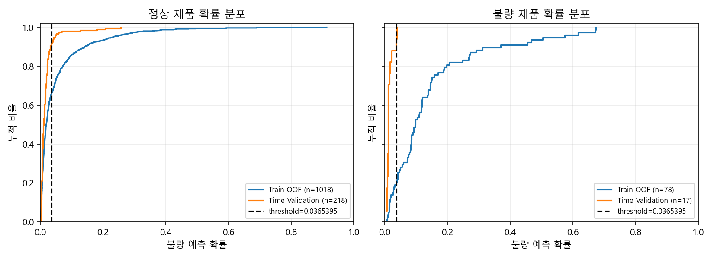
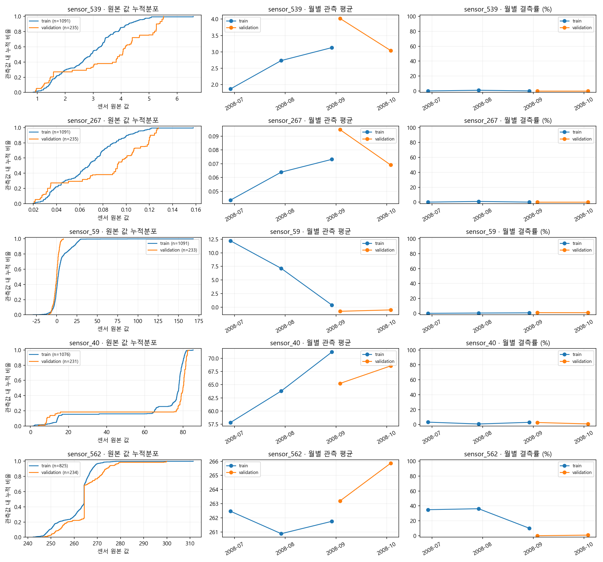

# SECOM WaferGuard 실험·평가 보고서

> 전처리 변경: 공통 Pipeline 앞단에 학습 데이터 기준 결측률 초과·상수 센서 제거와 제거 로그를 추가했다. 1~20절은 필터 적용 전의 탐색 기록이며, 필터 적용 후 Step 4~9 재실행 결과는 21절, 코드화한 시간순 내부 검증 결과는 22절에 기록했다.

> 기준 시점: 2026-10-07 사용자 결정으로 최소 Recall 80%·양성 비율 상한 40%의 임시 정책을 설정하고 32절에 기록했다. 31절 이전의 90%·20% 정책 판정은 당시 실험 기록으로 보존한다. S0 선택기를 유지한 XGBoost M0~M3 비교는 31절, S0~S3 선택기 비교는 30절에 있다. 아래 수치는 최종 Test 성능이 아니다.

> 최신 결과: 시간 검증·입력 분포 진단·최근 기간 학습·센서 고정 대조는 **33절**에 통합했다. 최종 보고서 작성 시 33절의 검증 범위와 한계를 함께 사용한다. 32절의 정책 설정은 시간 검증 성능 목표 달성을 뜻하지 않는다.

> 후속 평가 완료: 동결한 S0·M3 Top-20 저장 모델의 236행 평가 결과는 **34절**에 기록했다. Recall 11.11%·AP 0.040461로 80%·40% 정책은 미충족이다. 과거 완전한 미사용 여부를 보증할 수 없어 기존 데이터의 후속 시간 구간 평가로 표현하며, 결과에 맞춘 모델·문턱 변경이나 재평가는 하지 않았다.

> 평가 해석 정정: 기존 Time Validation 235행 중 163행이 Random Train에도 포함되어 후보 비교·OOF 탐색에 사용됐다. 아래 수치는 탐색 기록이며 독립적인 미사용 holdout 성능이 아니다. 새 실행 경로는 시간 holdout을 먼저 분리하고 동일한 Time Train만 사용한다. 기존 `0.000475`는 승계하지 않으며, 평균 OOF와 단일 재학습 모델의 확률 척도 차이도 있으므로 성능 하락을 drift만으로 단정하지 않는다. 이미 관찰한 데이터는 재분할해도 미사용 데이터가 되지 않는다.

## 1. 요약

4~9절은 기존 탐색 실험 기록이며, 12~18절은 교정된 평가 경로의 재실행 및 추가 진단 결과다.

- SECOM 1,567개 생산 단위와 590개 센서 feature를 대상으로 불량(Fail) 조기 탐지 실험을 진행했다.
- Random Validation Baseline은 AP 0.1985, Fail Recall 0.2667을 기록했다.
- Time-based Validation Baseline은 AP 0.0679, Recall 0.0000으로 하락했다.
- Time Train/Validation 사이에서 분포 변화 우선순위가 ‘높음’인 특징 242개를 확인했다. Fail 비율 변화는 0.12%p로 작았다.
- 반복 CV에서 LightGBM은 AP·ROC-AUC, L1 Logistic Regression은 고정 threshold Recall이 가장 높았다.
- 특징 선택 비교에서 LightGBM 전체 590개 feature가 AP 기준으로 가장 높았다. L1 선택 모델은 평균 약 187개 feature로 줄여도 Random CV 성능 변화가 작았다.
- 기존 LightGBM OOF의 F1 최대 threshold `0.000475`를 Time Validation에 그대로 적용했을 때 TP 0, FN 17이었다. 이 값은 탐색 기록으로만 보존했다.
- 교정된 Time Train의 단일 OOF 후보 약 `0.00002343`을 시간 검증에 적용한 결과는 TP 1·FP 19·FN 16이었다. Time Train 내부 시간 순서 검증에서도 구간별 성능 변동이 컸으므로 최종 모델·threshold는 아직 확정하지 않았다.

### 최신 실험 요약

최신 실험의 핵심 요약은 다음과 같다. 앞의 요약 항목은 과거 실험의 이력을 보존한 것이며 현재 성능을 대신하지 않는다.

- S0·M3 Top-20의 단일 Train OOF에서는 Recall 80.77%·양성 비율 37.14%로 임시 80%·40% 정책을 만족하는 문턱 후보를 선택했다.
- 동일 문턱의 시간순 Validation에서는 Recall 5.88%·AP 0.077252로 정책을 만족하지 못했다. 이 결과를 최종 Test 성능으로 표현하지 않는다.
- 같은 M3 전체 센서 모델의 Validation AP는 0.090454였다. Top-20의 상대 하락률은 14.60%지만 두 모델 모두 절대 성능이 낮아 센서 축소 목표와 현장 적용 성능을 구분한다.
- 선택 센서 20개 중 분포 변화 확인 우선순위가 높은 센서는 13개였다. 시간 변화의 정황은 있으나 성능 저하의 인과관계는 확정하지 않았다.
- Train 내부 최근 30일 학습은 전체 과거 학습보다 평균 AP가 낮았고 센서를 고정해도 개선되지 않았다. 현재 기준 경로를 유지하며 최근 기간 전략의 채택 근거는 부족하다.

### 1.1 주요 용어

이 보고서는 **불량(Fail)을 양성, 정상(Pass)을 음성**으로 해석한다. 비율 `0.70`은 `70%`를 뜻하며, 모델의 양성 판정은 최종 검사로 확인한 실제 불량과 구분한다.

#### 데이터와 전처리

| 용어 | 뜻과 이 보고서에서의 사용 |
| --- | --- |
| 샘플 / 생산 단위 | 데이터의 한 행. 센서 측정값과 최종 Pass/Fail 결과가 연결된 대상 하나다. |
| 센서 / Feature(특징) | 센서는 원본 측정 항목, feature는 모델이 사용하는 입력 변수다. SECOM의 `sensor_*`는 원본 센서 특징이며 PCA 성분 같은 변환 특징과 구분한다. |
| Label(라벨) / 양성·음성 | 예측의 정답. SECOM은 Fail `1`이 양성, Pass `-1`이 음성이다. |
| 클래스 불균형 | 정상과 불량의 수가 크게 다른 상태. 정상만 예측해도 정확도가 높을 수 있어 불량 중심 지표를 함께 확인한다. |
| 결측값 / 결측률 | 기록되지 않은 값과 그 비율. 결측률은 해당 센서의 결측 행 수를 전체 행 수로 나눈 값이다. |
| 상수 센서 / Zero-variance | 관측값이 하나뿐인 센서. 현재 품질 필터는 결측률 기준 초과 센서를 먼저 제거하고, 남은 센서 중 결측을 제외한 고유값이 하나 이하인 센서를 제거한다. |
| Imputation(결측 대치) | 비어 있는 값을 채우는 처리. 수치형 센서는 학습 데이터의 중앙값(median)을 저장해 이후 입력에도 적용한다. |
| Scaling / StandardScaler | 변수별 값의 규모를 맞추는 처리. StandardScaler는 학습 평균·표준편차로 표준화하며, 값이 반드시 0~1로 변하는 것은 아니다. |
| Pipeline | 전처리·특징 선택·모델을 순서대로 연결한 처리 묶음. 각 학습 fold에서만 통계를 학습하도록 구성한다. |
| fit / transform / predict | `fit`은 통계·센서 선택·모델을 학습하는 작업, `transform`은 저장된 변환을 적용하는 작업, `predict`는 학습된 모델로 판정하는 작업이다. 추론에서 전처리를 다시 fit하지 않는다. |
| EDA | 탐색적 데이터 분석. 결측·분포·시간 변화 등을 점검하는 단계이며, EDA 제거 후보를 곧바로 모델의 전역 센서 제거 결과로 사용하지 않는다. |

#### 데이터 분할과 검증

| 용어 | 뜻과 주의할 점 |
| --- | --- |
| Train / Validation / Test | Train은 학습, Validation은 개발 중 비교·검증, Test는 최종 설정 동결 후 평가에 사용하는 데이터다. 이미 관찰한 구간은 다시 나눠도 미사용 데이터가 되지 않는다. |
| Holdout | 학습과 분리해 둔 평가 부분. 독립적인 미사용 평가라고 하려면 그 데이터가 모델·센서·threshold 선정에도 쓰이지 않았어야 한다. |
| Random split / stratify | 무작위 분할과 클래스 비율을 비슷하게 유지하는 분할 옵션. 시간 순서 보존을 의미하지 않는다. |
| Time-based split / Time Validation | 과거를 학습하고 이후 시간 구간을 평가하는 방식. 시간순 분할에는 shuffle·stratify를 적용하지 않는다. |
| CV(Cross-validation) / Fold | 교차 검증과 그 분할 구간. 5-fold는 데이터를 다섯 부분으로 나누고 각 부분을 한 번씩 평가 대상으로 사용하는 방식이다. |
| RepeatedStratifiedKFold | 클래스 비율을 고려한 K-fold를 반복하는 방식. 5-fold × 5회는 25개 학습·평가 결과를 만들지만 독립 데이터 25개를 확보한 것은 아니다. |
| OOF(Out-of-Fold prediction) | 해당 행을 학습하지 않은 fold 모델이 만든 예측. 학습 데이터 내부에서 threshold 후보를 비교하는 데 사용하며 최종 Test 예측은 아니다. |
| 단일 OOF / 반복 평균 OOF | 단일 계층 OOF는 행마다 한 번 예측한다. 반복 평균은 여러 미학습 예측을 평균한 분석용 점수로, 한 번의 최종 재학습 모델과 확률 척도가 같다고 가정하지 않는다. |
| 시간순 OOF / 확장형 검증 | 과거 학습 범위를 늘려 가며 다음 구간을 예측하는 방식. 처음의 학습 부분에는 OOF 예측이 없을 수 있으며, 미예측 행을 0점이나 정상으로 채우지 않는다. |
| Outer / Inner fold | 바깥 구간은 다음 시간 구간 평가용, 안쪽 구간은 그 과거 학습 데이터 안에서 OOF·튜닝·threshold 선택을 하는 부분이다. 바깥 평가의 정답으로 안쪽 선택을 하지 않는다. |
| Leakage(데이터 누수) | 평가 데이터의 정보가 전처리·센서 선택·학습·문턱 선택에 들어가는 문제. 평가 점수가 실제 일반화 성능보다 좋아 보일 수 있다. |

#### 불량 판정과 평가 지표

TP·FP·FN·TN은 실제 정답과 모델 판정을 비교한 건수다. 이 네 건수의 합이 전체 평가 수 `N`이다.

| 용어 | 뜻 / 계산식 |
| --- | --- |
| TP(True Positive) | 실제 불량을 불량으로 판정한 건수. 찾아낸 불량이다. |
| FP(False Positive) | 실제 정상을 불량으로 판정한 건수. 정상 오탐이다. |
| FN(False Negative) | 실제 불량을 정상으로 판정한 건수. 놓친 불량, 즉 미검이다. |
| TN(True Negative) | 실제 정상을 정상으로 판정한 건수. |
| Confusion matrix | TP·FP·FN·TN을 실제 클래스와 예측 클래스의 조합으로 정리한 표다. |
| Recall / Fail Recall(불량 검출률) | `TP / (TP + FN)`. 실제 불량 중 모델이 찾아낸 비율이다. |
| Precision(정밀도) | `TP / (TP + FP)`. 모델이 불량으로 판정한 대상 중 실제 불량의 비율이다. |
| F1 | `2 × TP / (2 × TP + FP + FN)`. Precision과 Recall의 조화평균으로, 현장 비용·검사 용량 기준을 대신하지 않는다. |
| FPR(정상 오탐률) | `FP / (FP + TN)`. 실제 정상 중 잘못 양성으로 판정한 비율이다. |
| 양성 판정 비율 / Alarm ratio / Reinspection ratio | `(TP + FP) / N`. 전체 중 모델이 양성으로 선별한 비율이다. 기존 로그의 재검사율은 이 값이며, 사람이 검사했거나 실제 추가 검사가 수행됐다는 뜻은 아니다. |
| Threshold(임계값·문턱) | 점수가 이 값 이상이면 양성으로 판정하는 기준. 같은 점수에서 문턱을 낮추면 선별 대상이 늘고 Recall은 감소하지 않지만 Precision은 반드시 좋아지지 않는다. |
| FN/FP trade-off | 불량 미검을 줄이려 할 때 정상 오탐·선별 부담이 늘 수 있는 관계. Recall만으로 최종 후보를 판단하지 않는다. |

Recall·Precision·F1의 정의는 [scikit-learn 평가 지표 문서](https://scikit-learn.org/stable/modules/generated/sklearn.metrics.precision_recall_fscore_support.html)를 따른다. 예측 양성이 없을 때 이 프로젝트의 Precision 기록값은 0이다.

**계산 예시 — 실제 실험 결과가 아님:** 제품 100개 중 실제 불량이 10개이고 TP 7·FP 13·FN 3·TN 77이면 Recall은 `7/10 = 70%`, Precision은 `7/20 = 35%`, 양성 판정 비율은 `20/100 = 20%`다. FPR은 `13/90 ≈ 14.44%`로 양성 판정 비율과 다르다.

#### 확률 순위와 결과 집계

| 용어 | 뜻과 해석 |
| --- | --- |
| Positive score / 예측 확률 | 분류기가 출력한 불량 점수 또는 추정 확률. 실제 불량 빈도와 정확히 일치하도록 보정됐다는 보장은 없다. 이상 탐지의 원본 점수는 확률과 구분한다. |
| PR curve | 문턱을 바꾸면서 Precision과 Recall의 관계를 그린 곡선이다. |
| AP(Average Precision) / PR-AUC | AP는 Recall 증가량으로 Precision을 가중해 PR 곡선을 요약한 지표다. 본 보고서는 PR 성능 비교에 AP를 사용한다. 사다리꼴 적분으로 계산한 PR-AUC와 완전히 같은 값은 아니다. |
| ROC-AUC | FPR과 Recall의 관계를 나타내는 ROC 곡선 아래 면적. 점수의 클래스 구분 순위를 요약하며 실제 사용 문턱의 Recall·오탐 부담과는 다르다. |
| 평균 ± 표준편차 | 여러 평가 결과의 평균과 흔들림 정도. 표준편차는 신뢰구간이나 통계적 우위의 증명이 아니다. |
| Fold 평균 / Pooled(합산) 지표 | Fold 평균은 구간별 지표를 평균한 값, pooled Recall·Precision은 구간의 오류 건수를 합쳐 계산한 값이다. 표본 수가 다르면 서로 달라질 수 있다. |
| F1 최대 진단 문턱 | 저장된 OOF 후보 중 F1이 가장 높은 값. Recall·양성 비율 정책을 충족한 문턱이나 최종 문턱과 구분한다. |
| Policy / Feasible / Infeasible | 정책은 목표 Recall·양성 비율 상한 같은 선택 조건이다. Feasible은 후보가 조건을 충족함, infeasible은 저장된 후보 중 충족값이 없음이다. OOF에서 충족해도 미래 구간의 충족을 보장하지 않는다. |

AP는 **선택한 문턱 하나의 검출률이 아니므로 AP 0.249를 Recall 24.9%로 읽지 않는다.** AP와 사다리꼴 PR-AUC의 차이는 [AP 공식 문서](https://scikit-learn.org/stable/modules/generated/sklearn.metrics.average_precision_score.html), ROC-AUC 계산은 [ROC-AUC 공식 문서](https://scikit-learn.org/stable/modules/generated/sklearn.metrics.roc_auc_score.html)를 참고한다.

#### 모델과 센서 선택

| 용어 | 뜻과 이 프로젝트에서의 역할 |
| --- | --- |
| Baseline | 개선 여부를 판단하기 위한 기준 모델. 이 프로젝트는 결측 대치·표준화·Logistic Regression을 기본 기준으로 사용한다. |
| Logistic Regression / L1 | Logistic Regression은 이름과 달리 이 프로젝트에서 이진 분류기다. L1 정규화는 일부 계수를 0으로 만들어 희소 센서 선택에 사용할 수 있다. |
| RBF SVM | 비선형 분류 경계를 학습하는 후보 모델. 이 프로젝트에서는 표준화 후 학습한다. |
| Random Forest(RF) | 여러 결정 트리의 결과를 결합하는 모델. 분류 후보이면서 중요도 기반 센서 선택기로도 사용한다. |
| LightGBM / XGBoost | 순차적으로 트리를 추가하며 손실을 줄이는 부스팅 계열 분류기. 선택용 모델과 최종 분류기는 서로 별개일 수 있다. |
| Feature importance / Gain | 특징 중요도는 모델별 학습 기여도 점수다. XGBoost의 gain은 해당 특징을 사용한 분할의 평균 손실 개선량이며 RF 불순도 중요도와 수치 크기를 직접 비교하지 않는다. |
| Top-K / Top-20 | 학습된 기준으로 상위 K개 특징을 선택하는 방식. Top-20은 현재 SECOM에서 원본 센서 20개 선택을 뜻하지만, fold마다 센서 목록은 달라질 수 있다. |
| PCA / 설명분산 90% | 원본 특징을 조합한 새로운 축으로 변환하고 학습 분산의 90%를 보존하도록 축 수를 정하는 방법. 불량 정보 90% 보존이나 원본 센서 20개 선택을 뜻하지 않는다. |
| Class weight / scale_pos_weight | 불량 등의 학습 손실에 가중치를 주는 설정. 재검사 비율이나 threshold 설정이 아니며 가중치 증가가 AP·Precision 개선을 보장하지 않는다. |
| Hyperparameter / Tuning | 깊이·트리 수·정규화 등 학습 전에 정하는 설정과 그 비교·선정 작업. Threshold 선택은 판정 단계의 별도 조절 작업으로 구분한다. |
| 센서 선택 안정성 | 여러 학습에서 같은 센서가 반복 선택되는 정도. 겹치는 학습 구간의 선택 빈도는 참고 자료이며 센서의 물리적 원인이나 성능 동등성을 증명하지 않는다. |

**입력 센서 수의 구분:** 최종 분류기가 20개 특징을 받아도 앞단의 품질 필터·대치기가 수백 개 센서를 요구할 수 있다. “분류기 입력 20개”와 “원본 20개만으로 추론 가능”은 별도로 확인한다.

#### 시간 변화와 이상 탐지

| 용어 | 뜻과 주의할 점 |
| --- | --- |
| Drift(분포 변화) | 시간 구간에 따라 센서 값·결측률·불량 비율 등의 분포가 달라지는 현상. 성능 하락의 유일한 원인이라고 단정하지 않는다. |
| PSI(Population Stability Index) | 기준 구간과 비교 구간의 값 분포를 구간별 비율로 비교한 수치. 이 코드에서는 Train 분위수 경계를 사용하며, 값이 크면 분포 차이를 추가 점검한다. p-value나 센서 제거 명령이 아니다. |
| 표준화 평균 차이 | `(평가 평균 - 학습 평균) / sqrt((학습 분산 + 평가 분산) / 2)`. 이 코드가 두 구간의 평균 차이를 규모에 맞춰 비교하는 방식이며, 모델의 StandardScaler와 별개다. |
| Drift 우선순위 높음·중간·낮음 | 결측률 변화·평균 차이·PSI 등을 조합한 프로젝트 점검 순위. 현장 표준 등급이나 자동 센서 제거 기준이 아니다. |
| Isolation Forest | 무작위 분할로 고립되기 쉬운 대상을 이상으로 점수화하는 모델. 이 프로젝트는 정상 데이터로만 학습한 뒤 불량 탐지와 비교한다. |
| PCA 복원오차 | 정상 데이터로 배운 PCA에서 입력을 복원했을 때의 차이. 본 실험은 표준화된 값의 평균 제곱오차를 사용하며 값이 클수록 이상으로 해석한다. |
| 이상 점수 | 정상 패턴에서 벗어난 정도를 나타내는 점수. 불량 확률이 아니므로 분류 확률의 threshold 0.50을 그대로 적용하지 않는다. |

PSI·표준화 평균 차이·우선순위의 구체적 계산은 [드리프트 진단 코드](../src/step3_drift_check.py), 이상 점수 정의는 [이상 탐지 코드](../src/anomaly_compare.py)에 있다.

## 2. 데이터와 품질 점검

| 항목 | 결과 |
| --- | ---: |
| 전체 샘플 수 | 1,567 |
| Fail 샘플 수 | 104 |
| 모델 입력 후보 feature 수 | 590 |
| 결측률 50% 초과 EDA 후보 | 28 |
| 상수 feature EDA 후보 | 116 |

EDA 후보는 전역 feature 제거 결과가 아니다. 실제 결측 처리와 feature 선택은 Train/CV 학습 fold 내부에서 수행한다.

## 3. 기존 탐색 실험의 분할과 평가 원칙

- Random split: Train/Validation/Test = 70/15/15, label stratify 적용
- Time-based split: timestamp 오름차순 70/15/15 분할, stratify 미적용
- 후보 모델 비교: `random_train.csv`에서 `RepeatedStratifiedKFold(5 folds × 5 repeats)` 사용
- 후보 비교 threshold: 0.50 고정
- Test set: 모델·feature·threshold 동결 전까지 사용하지 않음

교정된 평가 경로에서는 동일한 Time Train에서 후보 비교·특징 선택·단일 OOF threshold 탐색을 수행했다. 기존 Random Train 결과와 교정된 시간 평가 결과를 혼용하지 않으며, 상세 과정은 12~18절에 기록했다.

## 4. Baseline Validation 결과

| Split 방식 | Validation Fail 수 | Recall | Precision | F1 | AP | ROC-AUC |
| --- | ---: | ---: | ---: | ---: | ---: | ---: |
| Random | 15 | 0.2667 | 0.2222 | 0.2424 | 0.1985 | 0.7121 |
| Time-based | 17 | 0.0000 | 0.0000 | 0.0000 | 0.0679 | 0.4584 |

Random Validation에서는 15개 Fail 중 4개를 탐지했다. Time-based Validation에서는 17개 Fail을 모두 놓쳤다.

## 5. Time-based 분포 변화 진단

| drift 우선순위 | feature 수 |
| --- | ---: |
| 높음 | 242 |
| 중간 | 102 |
| 낮음 | 246 |

Fail 비율은 Train 7.12%에서 Validation 7.23%로 0.12%p만 변했다.

| Feature | PSI | 표준화 평균 차이 | 비고 |
| --- | ---: | ---: | --- |
| sensor_78 | 5.8508 | 1.0760 | 가장 큰 PSI |
| sensor_80 | 4.0431 | 0.4108 | 큰 분포 변화 |
| sensor_570 | 3.3330 | -0.0542 | 큰 분포 변화 |
| sensor_109 | 2.6961 | 1.3355 | 결측률 84.03% → 29.79% |

이 결과는 feature 제거 결정이 아니라 시간 변화·공정 조건·측정 환경을 추가 확인할 EDA 후보를 뜻한다.

## 6. 후보 모델 반복 CV 결과

> `random_train.csv` 1,096개 샘플, 5 folds × 5 repeats, threshold 0.50 고정.

| 모델 | AP 평균 ± 표준편차 | Recall 평균 ± 표준편차 | ROC-AUC 평균 ± 표준편차 | 평균 학습 시간(초) |
| --- | --- | --- | --- | ---: |
| LightGBM | 0.1860 ± 0.0518 | 0.0000 ± 0.0000 | 0.6863 ± 0.0453 | 1.6408 |
| Random Forest | 0.1748 ± 0.0483 | 0.0027 ± 0.0131 | 0.6767 ± 0.0646 | 2.8708 |
| LightGBM (`scale_pos_weight`) | 0.1639 ± 0.0515 | 0.0027 ± 0.0131 | 0.6667 ± 0.0464 | 1.6894 |
| L1 Logistic Regression | 0.1473 ± 0.0409 | 0.1836 ± 0.0688 | 0.6236 ± 0.0530 | 0.2171 |
| L1 Logistic Regression (`class_weight="balanced"`) | 0.1403 ± 0.0371 | 0.2657 ± 0.0660 | 0.6105 ± 0.0518 | 0.2495 |
| RBF SVM | 0.1338 ± 0.0315 | 0.0000 ± 0.0000 | 0.6436 ± 0.0557 | 0.2033 |

LightGBM은 확률 순위 성능이 가장 높지만 threshold 0.50에서 Fail을 예측하지 못했다. `scale_pos_weight` 적용은 AP를 낮추고 Recall을 거의 개선하지 못했다. L1 Logistic Regression의 `class_weight="balanced"` 적용은 Recall을 0.1836에서 0.2657로 높였지만 Precision과 AP를 낮췄다.

특징 선택과 Time Validation 이전의 상위 후보는 **LightGBM 전체 특징 모델**과 **L1 Logistic Regression (`class_weight="balanced"`)**이었다. 전자는 AP·ROC-AUC 관점에서, 후자는 고정 threshold의 Fail Recall 관점에서 선정한 후보였다.

## 7. 특징 선택 비교

> `random_train.csv` 1,096개 샘플, 5 folds × 5 repeats, threshold 0.50 고정.

| 실험 | 평균 선택 feature 수 | AP 평균 | Recall 평균 | ROC-AUC 평균 |
| --- | ---: | ---: | ---: | ---: |
| LightGBM 전체 | 590.00 | 0.1860 | 0.0000 | 0.6863 |
| LightGBM Top-100 | 100.00 | 0.1799 | 0.0109 | 0.6839 |
| LightGBM Top-50 | 50.00 | 0.1740 | 0.0110 | 0.6814 |
| L1 balanced 전체 | 590.00 | 0.1403 | 0.2657 | 0.6105 |
| L1 balanced + L1 선택 | 186.88 | 0.1403 | 0.2657 | 0.6105 |
| L1 balanced + PCA 90% | 126.56 | 0.1246 | 0.3038 | 0.6125 |

LightGBM Top-K는 전체 feature보다 AP가 낮았고 feature 선택기 학습 비용도 추가됐다. L1 선택은 feature 수를 줄이면서 Random CV 지표가 유지됐지만, Time Validation AP는 0.0637로 LightGBM 전체의 0.0874보다 낮았다.

## 8. Time Validation과 OOF threshold 검증

| 구간·설정 | AP | ROC-AUC | Recall | Precision | TP | FP | FN |
| --- | ---: | ---: | ---: | ---: | ---: | ---: | ---: |
| LightGBM, Time Validation, threshold 0.50 | 0.0874 | 0.5666 | 0.0000 | 0.0000 | 0 | 0 | 17 |
| LightGBM, Time Validation, threshold 0.000475 | 0.0874 | 0.5666 | 0.0000 | 0.0000 | 0 | 4 | 17 |
| LightGBM, Random Train OOF, threshold 0.000475 | 0.1664 | 0.7367 | 0.3288 | 0.2182 | 24 | 86 | 49 |

OOF에서는 Fail과 정상 점수의 차이가 있었지만, Time Validation에서는 Fail 점수가 전반적으로 낮아졌다. Time Validation Fail 17건의 최고 점수는 0.000033으로 고정 threshold보다 낮았고, threshold를 낮추면 FP가 빠르게 증가했다. 이는 단순 threshold 조정만으로 해결하기 어렵다는 뜻이다.

## 9. Time Validation 오류 사례 분석

| 오류 그룹 | 샘플 수 | 평균 행 결측률 | 점수 중앙값 |
| --- | ---: | ---: | ---: |
| FN | 17 | 2.87% | 0.00000109 |
| FP | 4 | 3.05% | 0.001217 |
| TN | 214 | 3.22% | 0.00000056 |

FN의 평균 행 결측률은 TN보다 낮아 단순 결측률이 Fail 미탐지의 직접 원인이라는 근거는 없다. `sensor_158`, `sensor_293`, `sensor_358`, `sensor_340`, `sensor_55`는 FN/TN 차이와 높은 drift 우선순위가 함께 관찰된 추가 확인 대상이다. 단, FN 17건·FP 4건의 작은 표본 분석이므로 feature 제거 또는 인과관계의 근거로 사용하지 않는다.

## 10. 남은 단계

- 동일한 Time Train 내부 시간 검증 구간에서 후보 모델 비교 및 개선 실험
- 개선 모델의 Time Validation 재확인과 후보·feature·threshold 동결
- Isolation Forest 또는 PCA reconstruction error 보조 실험 진행 여부 결정
- PCA 분산, feature importance, Random/Time 비교, 오류 사례 시각화
- 동결된 모델의 Test 단 한 번 평가

## 11. 한계

- Fail 샘플 수가 적어 split별 성능 변동이 크다.
- Time-based 성능 저하가 drift의 인과적 결과라고 단정할 수 없다.
- Time Validation 결과를 이미 확인했으므로, 개선 모델 선정은 Time Train 내부의 시간 순서 검증을 우선 사용해야 한다.
- Test set을 아직 평가하지 않았으므로 최종 일반화 성능은 확정할 수 없다.

## 12. 교정된 split 기준 Baseline·후보 비교 재실행

기존 결과는 보존하고 `data/splits/integrated/`의 동일한 Time Train을 사용했다. Train은 1,096행(Fail 78행), Validation은 235행(Fail 17행)이다. 후보 비교는 Time Train 내부의 Repeated Stratified K-Fold(5 folds × 5 repeats), threshold 0.50에서 수행했으며 Test를 평가하지 않았다.

### Baseline 시간 검증

Logistic Regression Baseline은 AP **0.0679**, ROC-AUC **0.4584**, Recall **0.0000**이었다. TP 0, FN 17, FP 2, TN 216으로 Fail을 검출하지 못했다. 이 구간은 이미 관찰한 개발용 검증 구간이며 새로운 미사용 평가 데이터가 아니다.

### Time Train 내부 후보 비교

| 후보 | AP 평균 ± 표준편차 | ROC-AUC 평균 | Recall 평균 @ 0.50 | Precision 평균 | F1 평균 |
| --- | ---: | ---: | ---: | ---: | ---: |
| LightGBM | 0.2360 ± 0.0621 | 0.7591 | 0.0052 | 0.0800 | 0.0097 |
| Random Forest | 0.2323 ± 0.0658 | 0.7416 | 0.0025 | 0.0400 | 0.0047 |
| LightGBM scale_pos_weight | 0.2285 ± 0.0616 | 0.7487 | 0.0102 | 0.1400 | 0.0189 |
| L1 Logistic Regression | 0.1762 ± 0.0544 | 0.6570 | 0.1685 | 0.1928 | 0.1768 |
| RBF SVM | 0.1758 ± 0.0408 | 0.6832 | 0.0000 | 0.0000 | 0.0000 |
| L1 Logistic Regression balanced | 0.1726 ± 0.0515 | 0.6524 | 0.2635 | 0.1664 | 0.2025 |

- LightGBM의 AP 평균이 가장 높지만 Random Forest와의 차이는 약 0.0037이다. 평균 ± 표준편차 범위가 겹치지만, 범위의 중첩 여부만으로 통계적 우위를 판단할 수는 없다. 별도의 검정을 수행하지 않았으므로 우위를 확정하지 않으며, 표준편차를 신뢰구간으로 해석하지 않는다.
- 고정 threshold Recall은 L1 balanced가 가장 높다. AP 순위와 threshold 0.50의 검출 성능은 서로 다른 기준이므로 함께 검토한다.
- 기존 Random Train과 학습 표본 구성이 다르므로 과거 AP 대비 상승을 모델 자체의 개선 효과로 해석하지 않는다.
- 내부 CV는 시간 순서 검증이 아니라 과거 학습 구간 내부의 계층 CV다. 이 결과만으로 이후 시간 구간 성능을 보장하지 않는다.
- 이 단계에서는 최종 모델·threshold를 확정하지 않았다. 이후 동일한 Time Train에서 Step 6 특징 선택 비교를 재실행했다(13절).

재실행 로그: `logs/integrated/baseline.csv`, `logs/integrated/model_compare.csv`. 후보 비교 로그에는 학습 split 생성 계약을 기록했다.

## 13. 교정된 split 기준 특징 선택 비교 재실행

Step 5와 동일한 Time Train 및 5 folds × 5 repeats CV, threshold 0.50을 사용했다. 대치·scaling·PCA·L1·Importance 선택기는 매 학습 fold 안에서만 fit했으며 외부 Validation·Test는 이 실험에서 사용하지 않았다. 로그는 `logs/integrated/feature_compare.csv`에 저장했다.

| 실험 | 평균 특징 수 | AP 평균 ± 표준편차 | Recall 평균 @ 0.50 | Precision 평균 | ROC-AUC 평균 |
| --- | ---: | ---: | ---: | ---: | ---: |
| LightGBM 전체 | 590 | 0.2360 ± 0.0621 | 0.0052 | 0.0800 | 0.7591 |
| LightGBM Top-100 | 100 | 0.2302 ± 0.0760 | 0.0180 | 0.2333 | 0.7493 |
| LightGBM Top-30 | 30 | 0.2259 ± 0.0790 | 0.0492 | 0.3013 | 0.7315 |
| LightGBM Top-50 | 50 | 0.2202 ± 0.0719 | 0.0317 | 0.2167 | 0.7320 |
| LightGBM Top-20 | 20 | 0.2154 ± 0.0646 | 0.0643 | 0.3233 | 0.7287 |
| LightGBM Top-10 | 10 | 0.1975 ± 0.0689 | 0.0487 | 0.2073 | 0.7193 |
| L1 balanced 전체 | 590 | 0.1726 ± 0.0515 | 0.2635 | 0.1664 | 0.6524 |
| L1 balanced + L1 선택 | 185.56 | 0.1725 ± 0.0515 | 0.2635 | 0.1664 | 0.6522 |
| L1 balanced + PCA 90% | 127.48 | 0.1280 ± 0.0362 | 0.3085 | 0.1110 | 0.5935 |

- AP 기준 전체 LightGBM을 우선 후보로 유지한다. Top-100은 특징 수를 약 83% 줄이면서 AP 평균 차이가 약 0.0058이므로 경량 대안이다. 통계적 동등성이나 비열등성을 검증한 결과는 아니다.
- L1 선택은 특징 수를 약 69% 줄이며 전체 L1 balanced와 AP·Recall이 거의 같았다. 다만 이는 fold별 재선택 결과이며 최종 센서 집합이 고정된 것은 아니다. 선택기를 학습한 뒤 같은 L1 모델을 다시 학습하는 구성이라는 점도 고려한다.
- PCA는 Recall이 가장 높았지만 AP·Precision·F1이 낮아졌다. Recall 하나만으로 전체 특징 방식보다 우수하다고 판단하지 않는다.
- 학습 시간에는 selector 학습이 포함된다. 특징 수를 줄여도 Top-K 학습 시간은 전체 LightGBM보다 길었으며, 추론 속도는 이번 실험에서 측정하지 않았다.
- 이 단계에서는 후보를 최종 확정하지 않았다. 이후 사전 비교 후보의 시간 검증을 수행하고(14절), 동일한 Time Train의 단일 OOF에서 threshold 후보를 새로 생성했다(15절). 이미 관찰한 외부 시간 구간은 개발용 검증 구간으로 취급한다.

## 14. 교정된 split 기준 사전 후보 시간 검증

Step 5·6에서 확인한 LightGBM 전체 특징 모델과 L1 balanced 선택 모델을 동일한 Time Train 1,096행으로 학습하고, Time Validation 235행(Fail 17행)에서 평가했다. threshold는 비교 기준 0.50을 유지했고, Validation에서 threshold를 탐색하거나 Test를 평가하지 않았다. 로그는 `logs/integrated/time_validation.csv`다.

| 후보 | 특징 수 | AP | ROC-AUC | Recall | TP | FP | FN | TN |
| --- | ---: | ---: | ---: | ---: | ---: | ---: | ---: | ---: |
| LightGBM 전체 | 590 | 0.0874 | 0.5666 | 0.0000 | 0 | 0 | 17 | 218 |
| L1 balanced + L1 선택 | 214 | 0.0637 | 0.4185 | 0.0000 | 0 | 4 | 17 | 214 |

- 두 후보 모두 threshold 0.50에서는 Fail 17건을 모두 놓쳤다. LightGBM의 AP·ROC-AUC는 상대적으로 높지만, 시간 구간에서의 검출 성능이 확보됐다고 볼 수 없다.
- LightGBM은 내부 CV AP 0.2360에서 시간 구간 AP 0.0874로 낮아졌다. 학습·평가 구간과 학습 표본 수가 다르므로 하락 원인을 drift 하나로 단정하지 않는다.
- L1 선택 수 214개는 전체 Time Train에 fit한 결과다. Step 6의 평균 185.56개는 CV 학습 fold별 평균이므로 서로 일치할 필요는 없다.
- 이후 LightGBM 전체 특징 모델을 **threshold 탐색용 작업 후보**로 두고 같은 Time Train에서 단일 OOF 확률과 threshold 비교표를 생성했다(15절). 이는 최종 모델 확정이나 현장 적용 가능성 판단을 뜻하지 않는다.
- 새 threshold는 Train 내부 OOF에서만 비교한다. 기존 `0.000475`를 승계하거나 이번 Validation 결과를 보고 값을 조정하지 않는다. 해당 시간 구간은 이미 관찰한 개발용 검증 데이터이며 독립적인 최종 holdout으로 해석하지 않는다.

## 15. 교정된 Time Train 단일 OOF threshold 비교

LightGBM 전체 특징 작업 후보에 대해 5-fold **1회** OOF를 생성했다. 모델 비교의 5-fold × 5-repeats와는 별도 과정이며 반복 평균을 사용하지 않았다. 1,096행 모두 OOF 예측 횟수 1회, 원본 ID 1,096개를 확인했다. OOF AP는 **0.1893**, ROC-AUC는 **0.7388**이다.

threshold는 OOF 확률의 101개 분위수 지점과 기본 0.50을 합한 **102개 후보**에서 비교했다. 아래 F1 최대는 이 격자 안의 최대값이지 모든 가능한 threshold의 전역 최적값이나 독립 평가 성능이 아니다.

| 비교 기준 | threshold | Recall | Precision | F1 | TP | FP | FN | TN |
| --- | ---: | ---: | ---: | ---: | ---: | ---: | ---: | ---: |
| 기본 비교값 | 0.50 | 0.0000 | 0.0000 | 0.0000 | 0 | 0 | 78 | 1018 |
| 격자 내 F1 최대 후보 | 약 0.00002343 | 0.6410 | 0.1689 | 0.2674 | 50 | 246 | 28 | 772 |

- F1 최대 후보값을 적용하면 Fail 78건 중 50건을 검출하지만 정상 246건을 오탐한다. 양성 판정은 296/1,096행, 약 **27.0%**다. Precision 16.9%는 양성 판정 중 실제 Fail 비율이며, 나머지는 오탐이다.
- 이 값은 Train 내부의 프로젝트용 비교 후보다. 현장 검사 용량·FN/FP 비용을 반영한 운영 기준이나 최종 threshold로 확정하지 않는다.
- 단일 OOF AP와 반복 CV의 fold별 AP 평균 0.2360은 산출 방식이 다르다. 하나의 반복에서 모은 pooled OOF AP를 여러 fold의 AP 평균과 동일한 지표 집계로 해석하지 않는다.
- 단일 OOF도 fold별 학습 모델과 전체 Train 재학습 모델의 확률 척도가 일치한다고 보장하지는 않는다. 시간 검증에서 예측 확률 분포의 변화 가능성을 확인해야 한다.
- 기존 Random Train 반복 평균 후보 `0.000475`는 승계하지 않았다. 이번 단계에서는 Time Validation·Test를 읽거나 threshold 탐색에 사용하지 않았다.

로그: `logs/integrated/oof_predictions.csv`, `logs/integrated/threshold_compare.csv`. 생성 계약·단일 OOF 방식·후보값의 출처 검사를 통과했다. 이후 비교표에 저장된 **반올림하지 않은 값**을 그대로 전달하여 Time Validation의 FN·FP를 확인했으며(16절), 해당 결과로 threshold를 재조정하지 않았다.

## 16. 단일 OOF 후보값의 시간 검증

Step 8 비교표의 F1 최대 후보 **0.0000234308486649443**을 그대로 사용했다. 비교표의 데이터셋·Train 생성 계약·모델·단일 OOF 방식·후보값 존재 여부를 검사한 뒤 같은 Time Train으로 LightGBM 전체 특징 모델을 학습했다. 결과는 `logs/integrated/time_validation_oof_threshold.csv`에 별도 기록했으며 기존 threshold 0.50 결과를 보존했다.

| 평가 | Recall | Precision | F1 | TP | FP | FN | TN | 양성 판정 비율 |
| --- | ---: | ---: | ---: | ---: | ---: | ---: | ---: | ---: |
| Time Train 단일 OOF | 0.6410 | 0.1689 | 0.2674 | 50 | 246 | 28 | 772 | 27.0% |
| Time Validation, 동일 후보값 | 0.0588 | 0.0500 | 0.0541 | 1 | 19 | 16 | 199 | 8.5% |

시간 구간 AP는 **0.0874**, ROC-AUC는 **0.5666**으로 threshold 0.50 평가와 동일하다. AP·ROC-AUC는 확률 순위 지표이므로 threshold만 바꾸어도 바뀌지 않는다.

- threshold를 낮춰 Fail 1건은 검출했지만 17건 중 16건을 놓쳤다. 현재 후보를 불량 미검 감소 목표에 적합하다고 판단할 근거가 부족하므로 최종 모델·threshold 확정은 보류한다.
- 양성 판정 20건 중 실제 Fail은 1건이다. 단일 OOF보다 Recall·Precision이 낮아졌지만, 학습량·평가 구간·확률 척도 변화가 함께 있으므로 원인을 drift 하나로 단정하지 않는다.
- 이번 결과를 보고 Validation에서 threshold를 다시 탐색하지 않았고 Test도 평가하지 않았다. 시간 구간은 이미 관찰한 개발용 검증 데이터로 취급한다.
- 이후 **이번 후보값 기준 Step 9 FN/FP 분석**을 수행했다(17절). 기존 `0.000475` 오류 분석은 탐색 기록으로 보존하며 새 결과와 혼용하지 않는다. 개선 실험은 Time Train 내부에서 수행하고, 엄격한 일반화 확인에는 별도의 미사용 데이터가 필요하다.

## 17. 새 OOF 후보값 기준 FN/FP 사례 분석

동일한 Time Train/Validation에 threshold **0.0000234308486649443**을 적용해 오류 사례를 재생성했다. TP 1·FN 16·FP 19·TN 199로 Step 7 결과와 일치했고, 사례 235행의 원본 ID 235개를 확인했다. 모델·threshold를 변경하거나 Test를 평가하지 않았다.

| 오류 그룹 | 샘플 수 | 평균 행 결측률 | 예측 점수 중앙값 |
| --- | ---: | ---: | ---: |
| TP | 1 | 2.71% | 0.0000332829 |
| FN | 16 | 2.88% | 0.0000008456 |
| FP | 19 | 3.28% | 0.0000631319 |
| TN | 199 | 3.21% | 0.0000004914 |

FN의 평균 결측률은 TN보다 낮았다. 이 결과만으로 결측 처리 문제가 없다고 보장할 수는 없지만, 단순 결측량 증가가 미탐지의 원인이라는 근거는 없다. FN 16건의 최고 점수도 약 **0.0000138925**로 후보 threshold보다 낮았다. 이를 근거로 Validation에서 threshold를 낮추지는 않는다.

같은 split의 분포 변화 우선순위는 높음 242개·중간 102개·낮음 246개였다. Fail 클래스 비율 변화는 약 +0.12%p로 작았지만, 이것이 센서 분포의 안정성을 뜻하지는 않는다.

| 센서 | FN/TN 표준화 평균 차이 | 해석 |
| --- | ---: | --- |
| sensor_158 | 1.3920 | FN/TN 차이가 크고 높은 drift 우선순위도 있는 확인 대상 |
| sensor_293 | 1.3362 | FN/TN 차이가 크고 높은 drift 우선순위도 있는 확인 대상 |
| sensor_340 | 0.7126 | FN/TN 차이와 높은 drift 우선순위가 함께 있는 확인 대상 |

전체 FN/TN 절대 차이 순위에는 `sensor_345`, `sensor_100`도 포함된다. 반면 drift 점수 최상위인 `sensor_78`은 FN/TN 표준화 차이가 약 -0.0126으로 작았다. 따라서 **분포 변화 순위와 오류 그룹 차이 순위는 구분**하며, 높은 drift를 곧바로 미탐지 원인으로 해석하지 않는다.

FN 16건·FP 19건의 탐색 분석이며 센서 중요도, 인과관계, 최종 특징 선택 결과가 아니다. 이 시간 구간에서 발견한 센서를 그대로 선택하면 개발용 검증 정보가 모델에 반영되므로 이후 실험의 독립성에도 유의해야 한다.

로그: `logs/integrated/error_cases.csv`, `error_summary.csv`, `error_features.csv`, `temporal_drift_report.csv`, `temporal_drift_label_summary.csv`. 기존 탐색 로그는 보존했다. 이후 **Time Train 내부의 시간 순서 검증**으로 성능 변화가 학습 구간 안에서도 나타나는지 확인했다(18절). 최종 모델·threshold는 아직 미확정이다.

## 18. Time Train 내부 시간 순서 검증

Time Train 1,096행만 사용해 과거 구간을 학습하고 이후 구간을 평가하는 확장형 시간 검증을 3회 수행했다. 동일 timestamp를 하나의 단위로 묶어 `TimeSeriesSplit(n_splits=3)`을 적용했으며, 학습 종료 시각이 평가 시작 시각보다 앞서는지 검사했다. 외부 Time Validation과 Test는 읽지 않았다.

각 시간 구간의 학습 데이터 내부에서 단일 5-fold OOF를 생성하고, 동일한 분위수 격자의 F1 최대 threshold 후보를 구했다. 이 후보값을 해당 구간의 이후 데이터에 그대로 적용했다. 따라서 전체 Time Train에서 구한 threshold를 내부 평가 구간에 재사용하지 않았으며, 이후 구간의 label은 threshold 결정에 사용하지 않았다.

| 구간 | 학습 행 수 | 학습 Fail 수 | 평가 행 수 | 평가 Fail 수 | 구간별 threshold | AP | Recall | Precision | TP | FP | FN | TN |
| --- | ---: | ---: | ---: | ---: | ---: | ---: | ---: | ---: | ---: | ---: | ---: | ---: |
| 1 | 272 | 39 | 279 | 22 | 0.00107949 | 0.0939 | 0.2727 | 0.0750 | 6 | 74 | 16 | 183 |
| 2 | 551 | 61 | 273 | 8 | 0.00013448 | 0.0315 | 0.0000 | 0.0000 | 0 | 52 | 8 | 213 |
| 3 | 824 | 69 | 272 | 9 | 0.00003612 | 0.2299 | 0.5556 | 0.1020 | 5 | 44 | 4 | 219 |

- 학습 구간 안에서도 이후 구간의 AP·Recall 변동이 컸다. threshold 0.50에서는 세 구간 모두 Recall이 0이었다.
- 구간별 ROC-AUC는 각각 0.4639·0.5085·0.7651이었다. 확률 순위 성능도 일정하지 않으므로 문제를 threshold 하나만으로 설명하기 어렵다.
- 구간별 학습량·Fail 비율·학습 기간이 함께 달라졌다. threshold 변화나 성능 변동을 drift 하나의 효과로 단정하지 않는다.
- 서로 다른 threshold를 적용한 세 평가 구간의 합계는 TP 11·FP 170·FN 28·TN 615다. 이는 하나의 고정 threshold를 사용한 최종 모델의 평가 결과가 아니다.
- 각 구간의 OOF는 해당 과거 학습 데이터 내부의 계층 CV다. 외부 평가 구간은 시간순으로 분리했지만, 내부 threshold 탐색까지 시간순 CV로 수행한 것은 아니다.
- 이 결과는 메모리에서 수행한 진단이며 별도 실행 스크립트나 결과 CSV를 만들지 않았다. 후보 비교는 19절에 기록했다.

## 19. Time Train 내부 시간 구간별 후보 모델 비교

18절과 동일한 Time Train의 세 확장형 시간 구간을 사용해 LightGBM, fold 학습 구간의 `scale_pos_weight`를 적용한 LightGBM, Random Forest, L1 Logistic Regression balanced를 비교했다. 모든 모델은 같은 구간을 평가하고 threshold 0.50을 사용했다. Validation·Test는 읽지 않았다.

| 시간 구간 | 후보 | AP | ROC-AUC | Recall | TP | FP | FN |
| --- | --- | ---: | ---: | ---: | ---: | ---: | ---: |
| 1 | LightGBM | 0.0939 | 0.4639 | 0.0000 | 0 | 2 | 22 |
| 1 | LightGBM scale_pos_weight | 0.0804 | 0.4512 | 0.0455 | 1 | 4 | 21 |
| 1 | Random Forest | 0.0886 | 0.4682 | 0.0000 | 0 | 0 | 22 |
| 1 | L1 Logistic Regression balanced | 0.0863 | 0.5350 | 0.2273 | 5 | 65 | 17 |
| 2 | LightGBM | 0.0315 | 0.5085 | 0.0000 | 0 | 0 | 8 |
| 2 | LightGBM scale_pos_weight | 0.0432 | 0.5646 | 0.0000 | 0 | 0 | 8 |
| 2 | Random Forest | 0.1160 | 0.5212 | 0.0000 | 0 | 0 | 8 |
| 2 | L1 Logistic Regression balanced | 0.1698 | 0.5925 | 0.3750 | 3 | 79 | 5 |
| 3 | LightGBM | 0.2299 | 0.7651 | 0.0000 | 0 | 0 | 9 |
| 3 | LightGBM scale_pos_weight | 0.2260 | 0.7651 | 0.0000 | 0 | 0 | 9 |
| 3 | Random Forest | 0.2724 | 0.6367 | 0.0000 | 0 | 0 | 9 |
| 3 | L1 Logistic Regression balanced | 0.0431 | 0.5788 | 0.1111 | 1 | 58 | 8 |

세 구간의 단순 평균은 다음과 같다. 각 구간의 Fail 수가 다르므로, 이 평균은 pooled 전체 예측의 단일 성능 추정치가 아니다.

| 후보 | AP 평균 | ROC-AUC 평균 | Recall 평균 @ 0.50 | Precision 평균 |
| --- | ---: | ---: | ---: | ---: |
| Random Forest | 0.1590 | 0.5420 | 0.0000 | 0.0000 |
| LightGBM | 0.1184 | 0.5792 | 0.0000 | 0.0000 |
| LightGBM scale_pos_weight | 0.1165 | 0.5936 | 0.0152 | 0.0667 |
| L1 Logistic Regression balanced | 0.0997 | 0.5688 | 0.2378 | 0.0417 |

- Random Forest의 평균 AP가 가장 높지만 2·3구간 결과 차이가 크고 Recall은 세 구간 모두 0이었다. 평균 AP만으로 후보를 확정하지 않는다.
- L1 balanced는 세 구간 모두 Fail을 일부 검출했지만 FP가 총 202건(TP 9건)이었다. Recall 개선과 오탐 부담을 함께 봐야 한다.
- LightGBM의 불량 가중치는 구간 1에서만 Fail 1건을 추가 검출했고 나머지 두 구간에서는 Recall이 0이었다. 현재 설정만으로 안정적인 검출 개선이라고 결론 내릴 수 없다.
- 각 구간의 Fail 수가 22·8·9건으로 적고, 학습 표본도 272→551→824행으로 달라진다. 시간 변화 외에 표본 수와 클래스 구성도 결과에 영향을 줄 수 있으므로 원인을 drift 하나로 단정하지 않는다.
- 이 비교는 Time Train에서의 후보 탐색이다. 세 구간을 반복해 보며 후보를 비교했으므로 독립 성능 검증으로 간주하지 않는다. 모델·threshold는 여전히 미확정이며 Test는 평가하지 않았다.

## 20. 시간순 OOF threshold의 다음 구간 전이 비교

각 18절의 시간 순서 학습 구간 안에서 다시 2-fold expanding `TimeSeriesSplit`을 적용해 OOF 점수를 만들고, 102개 분위수·기본 threshold 후보 중 F1이 가장 높은 값을 골랐다. 그 threshold를 해당 학습 구간 전체에 fit한 모델로 바로 다음 시간 구간에 적용했다. 다음 구간의 label은 threshold 선택에 사용하지 않았다. 동일한 세 구간과 절차를 네 후보에 적용했다.

| 구간 | 모델 | 학습 내부 threshold | 다음 구간 Recall | Precision | F1 | TP | FP | FN | TN |
| --- | --- | ---: | ---: | ---: | ---: | ---: | ---: | ---: | ---: |
| 1 | LightGBM | 0.0000002065 | 0.9545 | 0.0766 | 0.1419 | 21 | 253 | 1 | 4 |
| 1 | LightGBM scale_pos_weight | 0.0000001705 | 0.9545 | 0.0775 | 0.1433 | 21 | 250 | 1 | 7 |
| 1 | Random Forest | 0.1000 | 0.9545 | 0.0808 | 0.1489 | 21 | 239 | 1 | 18 |
| 1 | L1 Logistic Regression balanced | 0.0003928528 | 0.8636 | 0.0748 | 0.1377 | 19 | 235 | 3 | 22 |
| 2 | LightGBM | 0.0056486961 | 0.0000 | 0.0000 | 0.0000 | 0 | 2 | 8 | 263 |
| 2 | LightGBM scale_pos_weight | 0.0012644740 | 0.1250 | 0.0455 | 0.0667 | 1 | 21 | 7 | 244 |
| 2 | Random Forest | 0.0801333333 | 0.6250 | 0.0242 | 0.0465 | 5 | 202 | 3 | 63 |
| 2 | L1 Logistic Regression balanced | 0.0004095034 | 1.0000 | 0.0340 | 0.0658 | 8 | 227 | 0 | 38 |
| 3 | LightGBM | 0.0026454519 | 0.1111 | 0.1667 | 0.1333 | 1 | 5 | 8 | 258 |
| 3 | LightGBM scale_pos_weight | 0.0000144060 | 0.6667 | 0.0706 | 0.1277 | 6 | 79 | 3 | 184 |
| 3 | Random Forest | 0.1856 | 0.2222 | 0.1429 | 0.1739 | 2 | 12 | 7 | 251 |
| 3 | L1 Logistic Regression balanced | 0.0783714913 | 0.2222 | 0.0217 | 0.0396 | 2 | 90 | 7 | 173 |

서로 다른 세 threshold로 나온 건수를 합산하면 다음과 같다. 세 구간의 평가는 각각 다른 운영 threshold를 사용하므로, 이는 threshold 하나의 성능이 아니라 전이 안정성을 살피기 위한 요약이다.

| 모델 | TP | FP | FN | TN | 전체 양성 판정 비율 | pooled Recall | pooled Precision |
| --- | ---: | ---: | ---: | ---: | ---: | ---: | ---: |
| LightGBM | 22 | 260 | 17 | 525 | 34.2% | 0.5641 | 0.0780 |
| LightGBM scale_pos_weight | 28 | 350 | 11 | 435 | 45.9% | 0.7179 | 0.0741 |
| Random Forest | 7 | 214 | 32 | 571 | 26.8% | 0.1795 | 0.0317 |
| L1 Logistic Regression balanced | 29 | 552 | 10 | 233 | 70.5% | 0.7436 | 0.0499 |

- 한 구간에서 선택한 threshold가 다음 구간으로 안정적으로 이어지지 않았다. 예를 들어 LightGBM threshold는 약 `2.07e-7`에서 `5.65e-3`, `2.65e-3`으로 크게 달라졌고, 첫 구간에서는 정상 257건 중 253건을 양성으로 판정했다.
- 이 F1 최대 탐색은 FP 비용이나 검사 용량을 반영하지 않는다. F1 후보를 적용한 결과 경보 비율은 모델·구간에 따라 크게 달랐다. 사용 가능한 검사 용량이 정의되지 않아 어느 threshold도 운영 후보로 확정하지 않는다.
- 세 학습 구간과 겹치는 시간 사용 및 반복된 후보 검토를 고려하면 이 결과는 내부 개발 진단이다. 모델의 최종 일반화 성능으로 주장하지 않으며 Time Validation/Test 성능도 대체하지 않는다.
- 결과는 메모리에서 산출했으며 전용 스크립트·CSV를 만들지 않았다. 모델·threshold는 미확정 상태다. 다음 의사결정은 현장 재검사 용량 및 FN/FP 비용 기준을 정하는 것이다. 그런 기준이 생기면 각 과거 학습 구간에서 같은 제약을 사용해 threshold를 선택하고, 새로운 미사용 시간 구간으로 검증해야 한다.

## 21. 센서 품질 필터 적용 후 재실행 (2026-10-06)

### 실행 조건과 센서 제거 기록

기존 `data/splits/integrated/time_train.csv` 1,096행(Fail 78행)과 `time_valid.csv` 235행(Fail 17행)을 그대로 사용했다. Step 4 Baseline, Step 5 후보 비교, Step 6 특징 비교, Step 8 단일 OOF, Step 7 시간 검증, Step 9 오류 분석을 재실행했다. 시간순 내부 진단인 18~20절은 이번에 재실행하지 않았다. 외부 시간 검증 구간은 이미 관찰한 개발용 구간이며 Test는 평가하지 않았다.

모든 Pipeline은 품질 필터를 학습 데이터에서 fit한 뒤 결측 대치와 필요한 scaling·특징 선택을 수행했다. 전체 Time Train과 반복 CV 375개 학습 기록(후보 6개·특징 실험 9개 × 25 folds), 단일 OOF 5개 학습 fold에서 동일하게 결측률 50% 초과 센서 24개와 남은 센서 중 상수 122개를 제거했다. 원래 590개 센서 중 146개를 제거해 **444개**를 유지했다. 이 개수는 전체 데이터 EDA의 후보 수 28개·116개와 구별한다.

반복 CV는 5 folds × 5 repeats, seed 42, 비교 threshold 0.50을 유지했다. OOF는 동일한 Train의 단일 5-fold 예측이며, 1,096개 샘플마다 예측이 정확히 한 번 생성됐음을 확인했다. 실행 환경은 Python 3.10.22, scikit-learn 1.5.2, LightGBM 4.5.0이다. Step 6·7·8·9의 LightGBM 내부 병렬 처리 수는 2였다. 동시 실행했으므로 학습 시간은 이전 실행과 직접 비교하지 않는다.

### 후보 모델 비교

| 모델 | 필터 전 CV AP | 필터 후 CV AP 평균 ± 표준편차 | Recall @ 0.50 | ROC-AUC 평균 |
| --- | ---: | ---: | ---: | ---: |
| LightGBM | 0.2360 | 0.2424 ± 0.0665 | 0.0027 | 0.7628 |
| LightGBM scale_pos_weight | 0.2285 | 0.2374 ± 0.0692 | 0.0153 | 0.7523 |
| Random Forest | 0.2323 | 0.2324 ± 0.0590 | 0.0025 | 0.7531 |
| RBF SVM | 0.1758 | 0.1716 ± 0.0361 | 0.0000 | 0.6880 |
| L1 Logistic Regression | 0.1762 | 0.1690 ± 0.0493 | 0.1637 | 0.6576 |
| L1 Logistic Regression balanced | 0.1726 | 0.1688 ± 0.0489 | 0.2510 | 0.6514 |

LightGBM 계열의 AP는 높아졌지만 모든 후보가 개선된 것은 아니다. AP 평균 차이는 기술적인 비교이며 통계적 유의성을 확인한 결론은 아니다. 비교 threshold 0.50에서의 불량 검출은 여전히 제한적이다.

### 특징 축소 비교

| 실험 | 평균 특징 수 | 필터 전 CV AP | 필터 후 CV AP 평균 ± 표준편차 | Recall @ 0.50 |
| --- | ---: | ---: | ---: | ---: |
| LightGBM 품질 필터 후 전체 | 444.00 | 0.2360 | 0.2424 ± 0.0665 | 0.0027 |
| LightGBM Top-100 | 100.00 | 0.2302 | 0.2407 ± 0.0709 | 0.0182 |
| LightGBM Top-50 | 50.00 | 0.2202 | 0.2353 ± 0.0681 | 0.0363 |
| LightGBM Top-30 | 30.00 | 0.2259 | 0.2117 ± 0.0653 | 0.0282 |
| LightGBM Top-20 | 20.00 | 0.2154 | 0.2042 ± 0.0784 | 0.0390 |
| LightGBM Top-10 | 10.00 | 0.1975 | 0.1872 ± 0.0603 | 0.0437 |
| L1 balanced + L1 선택 | 181.16 | 0.1725 | 0.1689 ± 0.0489 | 0.2510 |
| L1 balanced 품질 필터 후 전체 | 444.00 | 0.1726 | 0.1688 ± 0.0489 | 0.2510 |
| L1 balanced + PCA90 | 121.08 | 0.1280 | 0.1393 ± 0.0410 | 0.3335 |

`lightgbm_all`과 `l1_balanced_all`의 all은 품질 필터 후 남은 센서 전체를 뜻한다. PCA의 특징 수는 센서 수가 아닌 성분 수다. Top-50은 원래 590개 센서의 1/10 이하이고 AP 평균이 전체 방식에 비교적 가까웠지만, 별도의 시간 검증이나 성능 동등성 검증을 수행한 것은 아니다. Top-20의 AP 평균은 전체 방식보다 약 0.038 낮아 동일 성능을 유지했다고 주장하지 않는다.

### OOF threshold와 시간 검증

새 LightGBM 단일 OOF의 AP는 **0.1930**, ROC-AUC는 **0.7479**였다. 기존과 동일하게 101개 분위수와 0.50을 합한 102개 후보에서 F1 최대값을 비교했다. 선택한 탐색 후보는 **0.00037729474027866034**이며, 새 비교표의 출처 검사를 통과한 뒤 반올림하지 않은 값을 Time Validation에 적용했다. 이는 현장 Recall 목표·검사 용량을 반영한 최종 threshold가 아니다.

| 평가 구간·모델 | threshold | AP | ROC-AUC | Recall | Precision | TP | FP | FN | TN |
| --- | ---: | ---: | ---: | ---: | ---: | ---: | ---: | ---: | ---: | ---: |
| Time Validation Baseline | 0.50 | 0.0683 | 0.4741 | 0.0000 | 0.0000 | 0 | 2 | 17 | 216 |
| Time Validation LightGBM | 0.50 | 0.1110 | 0.6576 | 0.0000 | 0.0000 | 0 | 0 | 17 | 218 |
| Time Validation L1 balanced 선택 | 0.50 | 0.0668 | 0.4544 | 0.0000 | 0.0000 | 0 | 8 | 17 | 210 |
| Train OOF LightGBM, 격자 내 F1 최대 후보 | 0.00037729474027866034 | 0.1930 | 0.7479 | 0.3462 | 0.2231 | 27 | 94 | 51 | 924 |
| Time Validation LightGBM, 같은 OOF 후보 | 0.00037729474027866034 | 0.1110 | 0.6576 | 0.0000 | 0.0000 | 0 | 3 | 17 | 215 |

OOF 후보의 F1은 0.2714이며 양성 판정 비율은 약 11.0%였다. 이는 threshold 탐색에 사용한 데이터의 수치로, 독립 성능 추정치가 아니다. 시간 검증 AP는 필터 전 0.0874에서 0.1110으로 높아졌지만, 새 OOF threshold로는 불량 17건을 모두 놓쳤다. 품질 필터 요구사항을 반영한 것과 조기 탐지 성능을 확보한 것은 구별해야 한다. 최종 모델·threshold는 여전히 미확정이다.

Step 9 오류 요약은 TP 0·FP 3·FN 17·TN 215로 시간 검증 결과와 일치했다. 오류 특징 비교와 행 결측률은 원래 590개 센서의 진단 정보이며, 제거 후 모델 입력 444개만의 통계가 아니다. 원본 split이 같으므로 기존 `logs/integrated/temporal_drift_report.csv`를 참고 정보로 재사용했다. 이 진단을 근거로 Validation에서 threshold를 다시 선택하지 않았다.

### 저장한 결과

새 결과는 `logs/quality_filtered_20261006/`에 저장해 기존 `logs/integrated/` 결과를 보존했다. 주요 파일은 `baseline.csv`, `model_compare.csv`, `feature_compare.csv`, `oof_predictions.csv`, `threshold_compare.csv`, `time_validation.csv`, `time_validation_oof_threshold.csv`, `error_cases.csv`, `error_summary.csv`, `error_features.csv`다. 학습별 제거 개수·센서명은 각 결과의 `quality_filter_log`, OOF는 `oof_predictions_quality_filter.csv`에 기록했다.

## 22. 코드화한 시간순 내부 검증 — 센서 필터 적용 후

### 평가 방법과 재현 명령

`src/temporal_validation.py`를 추가해 18~20절의 진단을 재생성 가능한 실험으로 정리했다. 동일한 Time Train 1,096행에서 timestamp 단위 `TimeSeriesSplit(n_splits=3)`로 아래 세 외부 구간을 만들었다. 정상·Fail 표본 수와 외부 경계는 기존 진단과 같으며, 외부 Time Validation과 Test는 읽지 않았다.

```powershell
python src/temporal_validation.py --train data/splits/integrated/time_train.csv --output-dir logs/temporal_validation_run --n-jobs 2
```

출력 폴더는 비어 있어야 한다. 확정 실행 결과는 `logs/temporal_quality_filtered_20261006_final/`에 저장했다. LightGBM·LightGBM scale_pos_weight·Random Forest·L1 Logistic Regression balanced의 공통 Pipeline을 사용했고, 센서 제거·대치·scaling은 각 학습 구간에서만 fit했다. LightGBM 불량 가중치는 해당 학습 구간에서 계산했다.

같은 외부 학습 모델의 예측 점수에 다음 세 threshold 방식을 적용했다.

- `default`: 설정의 0.50.
- `stratified_oof`: 각 과거 학습 구간 내부의 단일 계층 5-fold OOF에서 F1 최대 후보 선택.
- `temporal_oof`: 각 과거 학습 구간 내부의 timestamp 단위 확장형 2-fold OOF에서 F1 최대 후보 선택.

OOF 후보는 동일한 101개 분위수와 0.50의 중복을 제거한 최대 102개 값이다. 이후 평가 구간의 label은 threshold 선택에 사용하지 않았다. 시간순 OOF의 초기 미예측 행은 제외했으며 0점으로 채우지 않았다. 내부 시간순 경계·제외 범위를 코드로 명시했으므로, 과거 메모리 진단과의 차이를 센서 제거 하나의 효과로 단정하지 않는다.

### 시간 구간과 OOF 대상 수

| 구간 | 학습 행 / Fail | 평가 행 / Fail | 학습 종료 | 평가 시작 | 계층 OOF 행 | 시간순 OOF 행 | 초기 제외 행 |
| --- | --- | --- | --- | --- | ---: | ---: | ---: |
| 1 | 272 / 39 | 279 / 22 | 2008-08-18 15:41 | 2008-08-18 16:19 | 272 | 181 | 91 |
| 2 | 551 / 61 | 273 / 8 | 2008-08-29 22:56 | 2008-08-30 00:01 | 551 | 369 | 182 |
| 3 | 824 / 69 | 272 / 9 | 2008-09-13 09:19 | 2008-09-13 10:55 | 824 | 552 | 272 |

외부 학습의 센서 제거는 1구간에서 결측률 초과 20개·상수 122개로 잔여 448개, 2·3구간에서 결측률 초과 24개·상수 122개로 잔여 444개였다. 내부 OOF의 제거 기록도 각 내부 학습 데이터에서 따로 계산해 저장했다.

### 기본 threshold 0.50의 구간별 평균

| 모델 | AP 평균 ± 구간 표준편차 | ROC-AUC 평균 | Recall 평균 | 합산 TP | 합산 FP | 합산 FN |
| --- | ---: | ---: | ---: | ---: | ---: | ---: |
| Random Forest | 0.1561 ± 0.0798 | 0.5332 | 0.0000 | 0 | 1 | 39 |
| LightGBM | 0.1233 ± 0.0886 | 0.5710 | 0.0000 | 0 | 2 | 39 |
| LightGBM scale_pos_weight | 0.1201 ± 0.0912 | 0.5722 | 0.0152 | 1 | 4 | 38 |
| L1 Logistic Regression balanced | 0.0811 ± 0.0323 | 0.5605 | 0.2378 | 9 | 206 | 30 |

AP 평균과 표준편차는 서로 다른 세 시간 구간의 기술 통계이며 신뢰구간이나 반복 CV의 통계와 동일하지 않다. 기본 threshold에서도 L1은 검출과 오탐을 함께 늘렸고, AP가 높은 Random Forest는 Fail을 검출하지 못했다.

### 시간순 OOF threshold의 다음 구간 결과

아래 threshold는 표시용 반올림값이며 정확한 값은 `fold_results.csv`에 저장했다.

| 구간 | 모델 | threshold | Recall | Precision | TP | FP | FN | TN |
| --- | --- | ---: | ---: | ---: | ---: | ---: | ---: | ---: |
| 1 | LightGBM | 2.0652e-7 | 0.9545 | 0.0766 | 21 | 253 | 1 | 4 |
| 1 | LightGBM scale_pos_weight | 1.7045e-7 | 0.9545 | 0.0775 | 21 | 250 | 1 | 7 |
| 1 | Random Forest | 0.103333 | 0.9091 | 0.0797 | 20 | 231 | 2 | 26 |
| 1 | L1 balanced | 0.000385867 | 0.8636 | 0.0748 | 19 | 235 | 3 | 22 |
| 2 | LightGBM | 0.005648696 | 0.0000 | 0.0000 | 0 | 2 | 8 | 263 |
| 2 | LightGBM scale_pos_weight | 0.001264474 | 0.0000 | 0.0000 | 0 | 15 | 8 | 250 |
| 2 | Random Forest | 0.030000 | 1.0000 | 0.0296 | 8 | 262 | 0 | 3 |
| 2 | L1 balanced | 0.000406272 | 0.8750 | 0.0303 | 7 | 224 | 1 | 41 |
| 3 | LightGBM | 0.002645452 | 0.2222 | 0.2857 | 2 | 5 | 7 | 258 |
| 3 | LightGBM scale_pos_weight | 5.8395e-6 | 0.6667 | 0.0545 | 6 | 104 | 3 | 159 |
| 3 | Random Forest | 0.281433 | 0.2222 | 1.0000 | 2 | 0 | 7 | 263 |
| 3 | L1 balanced | 0.095826 | 0.2222 | 0.0222 | 2 | 88 | 7 | 175 |

### OOF 방식별 오탐 부담

| 모델 | OOF 방식 | 합산 Recall | 합산 Precision | 양성 판정 비율 | TP | FP | FN | TN |
| --- | --- | ---: | ---: | ---: | ---: | ---: | ---: | ---: |
| LightGBM | 계층 | 0.3333 | 0.0619 | 25.5% | 13 | 197 | 26 | 588 |
| LightGBM | 시간순 | 0.5897 | 0.0813 | 34.3% | 23 | 260 | 16 | 525 |
| LightGBM scale_pos_weight | 계층 | 0.2051 | 0.0584 | 16.6% | 8 | 129 | 31 | 656 |
| LightGBM scale_pos_weight | 시간순 | 0.6923 | 0.0682 | 48.1% | 27 | 369 | 12 | 416 |
| Random Forest | 계층 | 0.5385 | 0.0585 | 43.6% | 21 | 338 | 18 | 447 |
| Random Forest | 시간순 | 0.7692 | 0.0574 | 63.5% | 30 | 493 | 9 | 292 |
| L1 balanced | 계층 | 0.4872 | 0.0594 | 38.8% | 19 | 301 | 20 | 484 |
| L1 balanced | 시간순 | 0.7179 | 0.0487 | 69.8% | 28 | 547 | 11 | 238 |

세 구간의 평가 표본은 824행(Fail 39행)이다. 합산 지표는 구간별로 다른 모델 학습·threshold를 적용한 오류 건수를 합친 값이며 하나의 고정 모델·threshold 성능이 아니다. 같은 외부 모델 점수를 사용하므로 threshold 방식에 따라 AP·ROC-AUC는 변하지 않는다.

시간순 OOF 방식에서 Recall이 높아진 모델은 양성 판정 비율도 34~70%로 높았다. LightGBM은 1구간 Recall 0.9545에서 2구간 0으로 떨어졌고, Random Forest는 2구간 정상 265건 중 262건을 양성 판정해 Recall 1.0을 얻었다. 3구간 Random Forest의 Precision 1.0은 검출 2건·오탐 0건이라는 작은 표본의 결과다. 이런 수치를 근거로 안정적인 운영 성능이나 단일 최종 후보를 확정하지 않는다.

### 검증·산출물·다음 결정

전체 96개 자동 테스트가 통과했다. 저장한 96개 학습 기록의 시간 경계·제거 수 합계, 10,996개 OOF 기록의 모델·구간·방식별 행 중복 및 확률 범위, 9,888개 평가 예측 기록을 확인했다. 예측 기록 수에는 같은 평가 행을 네 모델·세 방식으로 비교한 중복 표현이 포함되며, 서로 다른 평가 행 수는 824다.

출력은 `folds.csv`, `fold_results.csv`, `summary.csv`, `predictions.csv`, `oof_predictions.csv`, `oof_coverage.csv`, `threshold_compare.csv`, `quality_filter.csv`, `temporal_run.json`이다. 코드·실행 조건·구간별 모델 파라미터·품질 제거 사유를 함께 남겼다.

담당 B의 시간순 내부 검증 작업은 완료했다. 다음 필수 작업은 목표 Recall 또는 허용 재검사 비율을 공동으로 정하고 그 조건으로 OOF threshold 후보를 비교하는 것이다. 현재 F1 최대값은 검사 용량을 반영하지 않은 탐색 후보이며 최종 모델·threshold는 미확정이다.

## 23. 정상 전용 이상 탐지 비교 (2026-10-06)

### 실행과 평가 조건

`src/anomaly_compare.py`로 Isolation Forest와 PCA 복원오차를 비교했다. 입력은 기존 Time Train 1,096행이며 22절과 같은 세 외부 시간 구간(평가 279·273·272행, Fail 22·8·9행)을 사용했다. 외부 Validation과 최종 Test는 읽지 않았다.

```powershell
python src/anomaly_compare.py --train data/splits/integrated/time_train.csv --output-dir logs/anomaly_run --supervised-dir logs/temporal_quality_filtered_20261006_final --n-jobs 2
```

명령의 출력 폴더는 새 폴더여야 한다. 이번 실제 실행 폴더는 `logs/anomaly_20261006/`이다. 지도학습 비교 로그의 Train 생성 계약·학습 설정·외부 기간 및 표본 수·내부 시간 fold 수를 확인했다.

- 학습 데이터에서 정상만 추출하고 센서 품질 필터·대치·scaling·모델까지 정상만 fit했다. 불량은 OOF·다음 구간 평가의 정답에만 사용한다.
- Isolation Forest는 200개 트리, `contamination="auto"`, seed 42로 학습했다. 원본 `score_samples`의 부호를 뒤집어 클수록 이상으로 통일했다.
- PCA는 정상 데이터의 누적 설명분산 90%를 보존하고 표준화된 입력과 복원값의 평균 제곱 오차를 이상 점수로 사용했다.
- 이상 점수는 불량 확률이 아니므로 확률 threshold 0.5를 적용하거나 평가 데이터로 0~1 정규화하지 않았다. 원본 점수의 OOF 분위수와 전체 미선별 후보를 비교했다.
- 각 외부 학습 구간 내부에서 시간순 OOF 2구간을 생성했다. 초기 미예측 행은 91·182·272행 제외했고 OOF 대상 수는 181·369·552행이었다.
- 현재 `config.json`의 Recall 최소 90%·재검사 최대 20% 정책은 그대로 사용했다. 조건 미충족이면 정책 threshold를 만들지 않으며, 별도로 F1 최대 진단 후보의 다음 구간 성능을 기록했다.

### 동일 구간의 지도학습·이상 탐지 비교

모든 아래 Recall·Precision·재검사 비율은 **과거 내부 시간순 OOF F1 최대 진단 후보**를 다음 구간에 적용한 합산 결과다. 정책 통과 결과가 아니며 구간마다 학습 모델과 threshold가 다르다. 세 구간 합계는 824행, 실제 Fail 39행이다. AP는 구간별 평균이고 AP 표준편차는 신뢰구간이 아니다.

| 접근 | 모델 | 평균 AP | AP 표준편차 | 합산 Recall | 합산 Precision | 재검사 대상 비율 | TP | FP | FN |
| --- | --- | ---: | ---: | ---: | ---: | ---: | ---: | ---: | ---: |
| 지도학습 | Random Forest | 0.1561 | 0.0798 | 0.7692 | 0.0574 | 63.5% | 30 | 493 | 9 |
| 지도학습 | LightGBM | 0.1233 | 0.0886 | 0.5897 | 0.0813 | 34.3% | 23 | 260 | 16 |
| 지도학습 | LightGBM scale_pos_weight | 0.1201 | 0.0912 | 0.6923 | 0.0682 | 48.1% | 27 | 369 | 12 |
| 이상 탐지 | Isolation Forest | 0.1083 | 0.0805 | 0.2051 | 0.0506 | 19.2% | 8 | 150 | 31 |
| 이상 탐지 | PCA 복원오차 | 0.0924 | 0.0554 | 0.5897 | 0.0529 | 52.8% | 23 | 412 | 16 |
| 지도학습 | L1 balanced | 0.0811 | 0.0323 | 0.7179 | 0.0487 | 69.8% | 28 | 547 | 11 |

### 이상 탐지의 구간별 결과

| 구간 | 모델 | 진단 threshold | AP | Recall | 재검사 대상 비율 | TP | FP | FN |
| --- | --- | ---: | ---: | ---: | ---: | ---: | ---: | ---: |
| 1 | Isolation Forest | 0.465151 | 0.0574 | 0.0000 | 2.2% | 0 | 6 | 22 |
| 2 | Isolation Forest | 0.416782 | 0.2220 | 0.6250 | 29.3% | 5 | 75 | 3 |
| 3 | Isolation Forest | 0.421063 | 0.0457 | 0.3333 | 26.5% | 3 | 69 | 6 |
| 1 | PCA 복원오차 | 0.330096 | 0.0871 | 0.6364 | 77.4% | 14 | 202 | 8 |
| 2 | PCA 복원오차 | 0.317134 | 0.1628 | 0.7500 | 35.2% | 6 | 90 | 2 |
| 3 | PCA 복원오차 | 0.268513 | 0.0274 | 0.3333 | 45.2% | 3 | 120 | 6 |

표의 threshold는 표시용으로 반올림했으며 실행에는 CSV 원본 값을 사용한다. 두 모델 모두 구간별 점수와 성능의 변동이 컸다. Isolation Forest는 1구간 불량 22건을 모두 놓쳤고 PCA는 1구간 전체의 77.4%를 추가 검사 대상으로 지정했다. PCA의 합산 검출 건수는 LightGBM과 동일한 23건이지만 추가 검사 정상은 412건으로 LightGBM의 260건보다 많았다. 이번 설정만으로는 이상 탐지가 지도학습의 한계를 해결했다는 근거가 없다. 작은 Fail 표본에서 특정 구간의 높은 AP만으로 우수성을 확정하지 않는다.

### 정책·누수 검증·한계

현재 90%·20% 정책은 두 모델 × 세 과거 학습 구간의 내부 OOF에서 모두 미충족이었다. `policy_selection.csv`의 threshold는 비어 있고 정책 기반 다음 구간 평가는 생성하지 않았다. 이는 `fold_results.csv`의 F1 진단 threshold 존재와 모순되지 않는다.

총 18개 fit의 불량 학습 건수는 모두 0이며, 실제 정상 학습 ID·기간·표본 수를 저장했다. 외부 fit의 정상 수는 233·490·755행, 센서 수는 448·444·444개, PCA 성분 수는 88·106·117개였다. OOF 기록 2,204행과 외부 점수 기록 1,648행은 각각 두 모델의 예측을 합한 수다. 모든 fit 기간이 다음 평가 시작보다 앞서고, 품질 제거 개수 합계와 정상 학습 ID를 확인했다. 전체 108개 자동 테스트가 통과했으며 불량 센서값 변경이 학습 결과에 영향을 주지 않는지, 미래 정답 변경이 OOF·threshold 선택을 바꾸지 않는지도 검사했다.

센서·scaling·PCA가 학습 구간마다 달라지므로 원본 이상 점수의 규모도 달라질 수 있다. 여러 내부 fit의 OOF 점수로 선택한 문턱을 다음 fit에 적용하는 것은 전이 가능성 진단이며 안정적인 확률 보정이나 운영 기준을 뜻하지 않는다. 정상에서 벗어난 패턴이 반드시 Fail인 것도 아니다.

산출물은 `folds.csv`, `fold_results.csv`, `summary.csv`, `predictions.csv`, `oof_predictions.csv`, `oof_coverage.csv`, `threshold_compare.csv`, `policy_selection.csv`, `quality_filter.csv`, `anomaly_compare.csv`, `anomaly_run.json`이다. `reports/analysis.ipynb` 6절에서 표·그래프를 확인한다. MLP·Autoencoder는 이번 구현에 포함하지 않았으며 딥러닝 교과 확장으로 별도 비교가 필요하다. 최종 모델·정책·threshold는 아직 미확정이다.

## 24. 시간순 센서 축소와 선택 안정성 (2026-10-06)

### 비교 조건과 실행

`src/feature_time_compare.py`로 전체 특징과 Top-50·Top-20을 22~23절과 같은 외부 시간 구간 3개에서 비교했다. 각 과거 학습 구간 내부의 시간순 OOF 2구간으로 threshold를 선택했다. 공통 시간 검증 코어를 재사용하므로 시간 경계·초기 제외·정책 선택 규칙은 동일하다. 외부 Validation·Test는 읽지 않았다.

```powershell
python src/feature_time_compare.py --train data/splits/integrated/time_train.csv --output-dir logs/feature_time_run --n-jobs 2
```

실제 산출물은 `logs/feature_time_20261006/`에 저장했다. 기존 결과를 보존하려면 실행 시 새 출력 폴더를 지정한다.

모든 분류기는 seed 42·트리 300개의 같은 LightGBM이다. 선택 방법만 LightGBM 중요도와 원본 과제의 RF 중요도로 바꿨다. RF 중요도 실험은 Random Forest 분류기 실험과 달리 **RF 선택기 → LightGBM 분류기**다. RF 선택기도 트리 300개·seed 42이며 기본 불균형 가중치를 유지했다. 이렇게 분류기를 통일해 선택 방법 차이를 비교했다. 품질 필터·대치·선택기는 학습 fold 안에서만 fit했다.

전체 특징 수는 외부 구간별 448·444·444개이며 전체 Time Train의 품질 필터 결과는 444개다. 444개를 미리 전역 고정해 모든 과거 구간에 적용하지 않았다. 범주형 데이터에서는 One-Hot 특징 수가 원본 센서 수와 다를 수 있으나 이번 SECOM 기록은 원본 센서명 기준이다.

### 같은 시간 구간의 성능 비교

다음 Recall·Precision·재검사 비율은 **각 과거 구간 내부 OOF의 F1 최대 진단 후보**를 다음 구간에 적용한 합산 결과다. 현재 90%·20% 정책을 충족한 최종 성능이 아니다. AP는 구간별 평균이고 표준편차는 신뢰구간이 아니다. 평가 합계는 824행·Fail 39행이다.

| 선택 방법 | 특징 수 | 평균 AP | AP 표준편차 | 합산 Recall | 합산 Precision | 재검사 대상 비율 | TP | FP | FN |
| --- | ---: | ---: | ---: | ---: | ---: | ---: | ---: | ---: | ---: |
| 전체 | 448/444/444 | 0.1233 | 0.0886 | 0.5897 | 0.0813 | 34.3% | 23 | 260 | 16 |
| LightGBM 중요도 | 50 | 0.0857 | 0.0479 | 0.6923 | 0.0682 | 48.1% | 27 | 369 | 12 |
| LightGBM 중요도 | 20 | 0.1081 | 0.0500 | 0.3333 | 0.0660 | 23.9% | 13 | 184 | 26 |
| RF 중요도 | 50 | 0.1006 | 0.0403 | 0.5897 | 0.0488 | 57.2% | 23 | 448 | 16 |
| RF 중요도 | 20 | 0.1038 | 0.0633 | 0.4615 | 0.0534 | 40.9% | 18 | 319 | 21 |

전체 특징 모델의 평균 AP가 가장 높았고 모든 축소 후보의 평균 AP는 낮았다. 다만 소수 Fail·세 구간의 변동이 있으므로 통계적 유의성이나 일반적인 모델 우수성을 확정하지 않는다.

LightGBM Top-50은 전체 모델보다 불량 4건을 더 찾았지만 정상 109건을 추가 선별해 전체 검사 대상이 113건 늘었다. Top-20은 전체 검사 대상을 86건 줄였으나 불량을 10건 덜 찾았다. RF 중요도 Top-50은 검출 건수가 동일한데 정상 추가 검사 수가 188건 많았다. 따라서 검사량·센서 수·검출률을 함께 비교해야 하며 센서 축소만으로 성능 문제가 해결됐다고 볼 수 없다.

### 구간별 AP와 불안정성

| 모델 | 1구간 AP | 2구간 AP | 3구간 AP |
| --- | ---: | ---: | ---: |
| 전체 | 0.0939 | 0.0326 | 0.2435 |
| LightGBM Top-50 | 0.0845 | 0.0277 | 0.1450 |
| LightGBM Top-20 | 0.0940 | 0.0551 | 0.1752 |
| RF 중요도 Top-50 | 0.0673 | 0.0773 | 0.1574 |
| RF 중요도 Top-20 | 0.0752 | 0.0447 | 0.1916 |

LightGBM Top-20은 1·2구간 AP가 전체 모델보다 높았지만 3구간에서는 낮았다. RF Top-50은 2구간 Recall 1.0을 얻었지만 FP 236건을 만들었고, 3구간에서는 불량 9건을 전부 놓쳤다. 센서 수가 적다는 이유로 안정적인 미래 성능을 주장하지 않는다.

### 선택 센서와 빈도

각 모델의 외부 fit 3회·내부 OOF fit 6회를 별도 기록했다. `selected_features.csv`에는 fit별 특징명·선택 방법·중요도·순위·원본/변환 특징 구분이 있고, `feature_frequency.csv`에는 역할별 분모와 선택 횟수가 있다. 빈도에는 품질 필터에서 제외된 경우도 비선택으로 반영된다. 학습 구간이 겹치므로 독립적인 반복 실험이나 통계 검정으로 해석하지 않는다.

| 선택 방법 | 외부 fit의 선택 특징 합집합 | 세 외부 fit에서 공통 선택한 특징 |
| --- | ---: | ---: |
| LightGBM Top-50 | 108개 | 9개 |
| LightGBM Top-20 | 42개 | 4개 |
| RF 중요도 Top-50 | 91개 | 16개 |
| RF 중요도 Top-20 | 38개 | 5개 |

LightGBM의 기본 split 중요도와 RF의 불순도 감소 중요도는 척도가 달라 숫자 자체를 비교하지 않는다. 선택 빈도와 순위도 불량의 인과 센서를 뜻하지 않는다.

전체 Time Train에서 각 방법을 다시 fit해 444·50·20·50·20개의 연구용 후보 목록을 `candidate_features.csv`에 저장했다. 모든 행은 `is_final=False`다. 이 후보 목록을 과거 CV의 특징으로 전역 고정하지 않았으며, 최종 학습 범위·선정 방법을 합의하면 해당 범위에서 다시 선택해야 한다.

### 정책·검증·남은 결정

현재 90%·20% 정책은 5개 모델 × 3개 내부 OOF에서 모두 미충족이었다. 기본 threshold 0.5 결과와 F1 최대 진단 결과를 별도로 보존했지만 정책 통과 후보를 자동 채택하지 않았다.

평가 fit 45회와 전체 Train 후보 fit 5회의 품질 제거 기록·특징 수를 저장했다. 선택된 센서명이 Pipeline의 실제 입력과 일치하는지, Top-K가 정확히 50·20개인지, 외부/내부 빈도 분모가 3·6인지, 후보가 최종으로 표시되지 않는지 테스트했다. 전체 110개 테스트가 통과했다. `reports/analysis.ipynb` 7절에서 비교 표와 선택 빈도 그래프를 확인한다.

축소 비교와 연구용 센서 자료 준비는 완료했다. 최종 모델·센서 집합 합의와 비전체 모델을 채택할 경우 OOF·시간 검증·오류 분석·실행기의 모델 연결은 남아 있다. 이 축소 실험 당시 `run_evaluation.py`의 대상은 `lightgbm_all`이었으며, 이후 XGBoost 연결과 비교를 추가했다(25절). 딥러닝 교과 평가가 추가됐으므로 MLP 비교도 최종 설정 동결 전에 별도로 수행해야 한다.

## 25. XGBoost 추가 비교 (2026-10-06)

### 실험 조건

동일한 `data/splits/integrated/time_train.csv` 1,096행(정상 1,018행·Fail 78행)만 사용했다. 기존 실험과 split 생성 계약이 같으며, 외부 Time Validation과 최종 Test는 이번에 읽거나 평가하지 않았다.

- 후보 비교: 5-fold × 5-repeats, seed 42, threshold 0.50.
- 품질 필터: 학습 fold에서 결측률 50% 초과·상수 센서를 제거한 뒤 중앙값 대치. 반복 CV에서 두 XGBoost 후보 모두 444개 센서를 사용했다.
- XGBoost: 트리 300개, 깊이 3, learning rate 0.05, subsample·colsample_bytree 0.8, reg_lambda 1.0, `tree_method=hist`. 이번 실험에서는 튜닝·SMOTE를 적용하지 않았다.
- 가중치 후보: 각 학습 구간에서 계산한 정상/Fail 건수 비율을 `scale_pos_weight`로 적용했다.
- threshold 정책: 최소 Recall 90%·최대 재검사율 20%. 미충족 시 임의 문턱으로 대체하지 않는다.
- 환경: Python 3.10.22, scikit-learn 1.5.2, LightGBM 4.5.0, XGBoost 2.1.3, pandas 2.2.3.

모델 설정과 fold별 학습 근거는 `logs/xgboost_20261006/temporal/temporal_run.json` 및 `quality_filter.csv`에 저장했다. 반복 CV는 모델 내부 병렬 수 1, 시간순·단일 OOF는 2로 실행했다. 실험들을 병행했으므로 학습 시간은 엄밀한 속도 비교 자료가 아니다.

### 반복 CV — 기존 후보를 포함한 재실행

| 모델 | AP 평균 ± 표준편차 | Recall 평균 (threshold 0.50) | ROC-AUC 평균 |
| --- | ---: | ---: | ---: |
| XGBoost 기본 | 0.2490 ± 0.0827 | 1.27% | 0.7541 |
| LightGBM 기본 | 0.2424 ± 0.0665 | 0.27% | 0.7628 |
| XGBoost 가중치 | 0.2410 ± 0.0834 | 8.97% | 0.7467 |
| LightGBM 가중치 | 0.2374 ± 0.0692 | 1.53% | 0.7523 |
| Random Forest | 0.2324 ± 0.0590 | 0.25% | 0.7531 |
| RBF SVM | 0.1716 ± 0.0361 | 0.00% | 0.6880 |
| L1 Logistic Regression | 0.1690 ± 0.0493 | 16.37% | 0.6576 |
| L1 Logistic Regression balanced | 0.1688 ± 0.0489 | 25.10% | 0.6514 |

XGBoost 기본 모델의 AP가 가장 높았지만 LightGBM과의 차이는 약 0.0066이다. 표준편차는 신뢰구간이 아니며 반복 CV fold도 독립 표본이 아니므로, 이 순위만으로 통계적 우위나 최종 후보 확정을 주장하지 않는다. XGBoost 가중치는 0.50에서 Recall을 높였지만 AP는 기본 모델보다 낮았다. 기존 여섯 모델의 지표 평균·표준편차는 이전 로그와 모두 일치했다.

원본: `logs/xgboost_20261006/model_compare.csv`.

### Train 내부 시간순 검증

과거 학습 → 다음 시간 구간 평가를 세 번 수행했다. 외부 평가 대상은 합계 824행(Fail 39행)이며, 최초 학습 구간은 평가에 포함하지 않는다. 각 과거 학습 구간 안에서만 계층 단일 OOF와 시간순 OOF를 만들었다. 시간순 OOF의 초기 미예측 91·182·272행은 제외하고 기록했다.

아래 Recall·재검사율은 시간순 내부 OOF의 F1 최대 진단 문턱을 다음 구간에 적용한 합산 결과다. 정책을 충족한 문턱이나 하나의 최종 모델 성능이 아니다.

| 모델 | 시간 구간 AP 평균 ± 표준편차 | 합산 Recall | 합산 Precision | 재검사율 | TP / FP / FN |
| --- | ---: | ---: | ---: | ---: | ---: |
| LightGBM 기본 | 0.1233 ± 0.0886 | 58.97% | 8.13% | 34.34% | 23 / 260 / 16 |
| LightGBM 가중치 | 0.1201 ± 0.0912 | 69.23% | 6.82% | 48.06% | 27 / 369 / 12 |
| XGBoost 기본 | 0.1553 ± 0.0649 | 53.85% | 7.89% | 32.28% | 21 / 245 / 18 |
| XGBoost 가중치 | 0.1749 ± 0.1332 | 71.79% | 6.21% | 54.73% | 28 / 423 / 11 |

XGBoost 가중치의 AP는 세 구간에서 0.1412 → 0.0312 → 0.3522로 크게 변했다. 평균만 보면 가장 높지만 중간 구간에서는 낮았고, 진단 Recall 증가에는 높은 재검사 부담이 따랐다. 기본 XGBoost의 AP 역시 0.1342 → 0.0886 → 0.2432로 변했다. 성능 하락의 원인을 drift 하나로 단정하지 않는다.

네 모델 × 세 외부 구간 × 두 내부 OOF 방식의 정책 선택 24건은 모두 90%·20% 조건 미충족이었다. LightGBM 두 후보의 시간순 요약 지표는 기존 실험과 일치했다.

원본: `logs/xgboost_20261006/temporal/summary.csv`, `fold_results.csv`, `policy_selection.csv`.

### 전체 Time Train의 단일 OOF — 운영 제약 비교

두 XGBoost 후보 모두 1회 5-fold로 샘플당 한 번의 OOF 확률을 생성했다. AP는 기본 0.1877, 가중치 0.1798이었다. 이 AP는 fold별 AP를 평균한 반복 CV 지표와 계산 방식이 다르다.

저장된 101개 분위수와 기본 threshold 후보 중, Recall 90% 이상에서 재검사율이 가장 낮은 후보를 비교했다.

| 모델 | 실제 Recall | 재검사율 | TP | FP | FN | 90%·20% 충족 |
| --- | ---: | ---: | ---: | ---: | ---: | --- |
| LightGBM 기본 — 기존 단일 OOF | 91.03% | 66.97% | 71 | 663 | 7 | 아니오 |
| XGBoost 기본 | 91.03% | 63.96% | 71 | 630 | 7 | 아니오 |
| XGBoost 가중치 | 91.03% | 67.97% | 71 | 674 | 7 | 아니오 |

기본 XGBoost는 같은 TP 71·FN 7에서 LightGBM보다 정상 재검사를 33건 줄였다. 다만 상한 20%와는 여전히 차이가 크다. 재검사율 20% 이하의 저장 후보 중 최대 Recall은 XGBoost 기본 46.15%(TP 36·FP 162·FN 42), 가중치 42.31%(TP 33·FP 176·FN 45)였다.

이 결과는 저장된 후보 격자 안의 비교이며 모든 가능한 threshold의 정확한 최적값을 뜻하지 않는다. 상세 문턱은 각 `threshold_compare.csv`의 반올림하지 않은 값을 확인한다. 정책 통과 후보가 없으므로 최종 threshold·모델을 확정하거나 외부 Validation을 추가 평가하지 않았다.

원본: `logs/xgboost_20261006/xgboost/`, `logs/xgboost_20261006/xgboost_scale_pos_weight/`.

### 재현 명령과 다음 단계

아래는 이번 실행 조건이다. 시간순 실험을 재실행할 때는 비어 있는 새 출력 폴더를 지정한다.

```powershell
python src/step5_model_compare.py --train data/splits/integrated/time_train.csv --output logs/xgboost_20261006/model_compare.csv
python src/temporal_validation.py --train data/splits/integrated/time_train.csv --output-dir logs/xgboost_20261006/temporal --models lightgbm lightgbm_scale_pos_weight xgboost xgboost_scale_pos_weight --n-jobs 2
python src/step8_threshold_oof.py --train data/splits/integrated/time_train.csv --experiment xgboost --oof-output logs/xgboost_20261006/xgboost/oof_predictions.csv --threshold-output logs/xgboost_20261006/xgboost/threshold_compare.csv --score-method single --n-jobs 2
python src/step8_threshold_oof.py --train data/splits/integrated/time_train.csv --experiment xgboost_scale_pos_weight --oof-output logs/xgboost_20261006/xgboost_scale_pos_weight/oof_predictions.csv --threshold-output logs/xgboost_20261006/xgboost_scale_pos_weight/threshold_compare.csv --score-method single --n-jobs 2
```

현재 판단은 **XGBoost 기본 모델을 후속 비교 후보로 유지하되, 운영 가능 모델로 확정하지 않는다**이다. 가중치도 비교 기록으로 보존한다. 다음 필수 확장은 같은 Train·학습 fold 내부 전처리·시간순 검증을 사용하는 MLP 딥러닝 비교다. 정책 합의와 최종 모델·threshold 동결 전까지 Test를 사용하지 않는다.

## 26. XGBoost 센서 선택 방법별 Top-20 비교 (2026-10-06)

### 실험 조건과 비교 대상

1단계로 같은 Time Train 1,096행(정상 1,018행·Fail 78행)에서 세 실험을 비교했다. `RepeatedStratifiedKFold` 5-fold × 5-repeats, seed 42, threshold 0.50을 사용했다. 이는 시간순으로 분리한 Train **내부의 계층 무작위 CV**이며 미래 시간 구간 평가가 아니다. 외부 Time Validation과 Test는 사용하지 않았다.

품질 필터·중앙값 대치·센서 선택은 매 학습 fold 내부에서만 fit했다. 세 실험의 모든 fold에서 원본 590개 센서 중 결측률 50% 초과 24개, 상수 122개를 제거해 444개가 남았다. 이후 두 축소 실험은 각각 정확히 20개를 선택했다.

| 실험 이름 | 센서 선택 방식 | 최종 분류기 |
| --- | --- | --- |
| `xgboost_all` | 품질 필터 후 전체 444개 | XGBoost 기본 |
| `xgboost_top_20` | XGBoost gain 중요도 상위 20개 | 같은 XGBoost 기본 |
| `xgboost_rf_top_20` | RF 불순도 감소 중요도 상위 20개 | 같은 XGBoost 기본 |

최종 분류기 설정은 세 실험 모두 트리 300개, 깊이 3, learning rate 0.05, subsample·colsample_bytree 0.8, reg_lambda 1.0, `tree_method=hist`, `scale_pos_weight=1`이다. RF 선택기는 트리 300개·Gini 기준을 사용했다. 선택용 모델과 축소 특징으로 학습하는 최종 분류기는 별개의 모델이다. 모델 내부 병렬 수는 2이며 튜닝·SMOTE·threshold 조절은 적용하지 않았다.

### 반복 CV 결과

| 센서 선택 방식 | 최종 분류기 입력 수 | AP 평균 ± 표준편차 | Recall 평균 | Precision 평균 | F1 평균 | ROC-AUC 평균 |
| --- | ---: | ---: | ---: | ---: | ---: | ---: |
| 전체 센서 | 444 | 0.2490 ± 0.0827 | 1.27% | 20.00% | 0.0238 | 0.7541 |
| RF 중요도 Top-20 | 20 | 0.2459 ± 0.0523 | 5.85% | 27.91% | 0.0933 | 0.7826 |
| XGBoost gain Top-20 | 20 | 0.2044 ± 0.0561 | 3.28% | 23.33% | 0.0557 | 0.7489 |

Recall·Precision·F1은 threshold 0.50에서의 fold별 평균이다. 합산 confusion matrix로 계산한 지표나 최종 성능이 아니다. AP는 threshold 0.50으로 이진화하기 전의 예측 확률 순위를 평가한다. 전체 센서 모델의 지표 평균·표준편차는 25절의 기본 XGBoost 결과와 일치했다.

같은 fold끼리 AP를 비교하면 다음과 같다. 아래 차이는 `Top-20 AP - 전체 AP`이며 표준편차는 25개 차이의 기술 통계다.

| 축소 방식 | AP 차이 평균 ± 표준편차 | 전체보다 AP가 높은 fold | 전체 평균 AP 대비 비율 |
| --- | ---: | ---: | ---: |
| RF 중요도 Top-20 | -0.0031 ± 0.0683 | 13 / 25 | 98.76% |
| XGBoost gain Top-20 | -0.0446 ± 0.0830 | 8 / 25 | 82.08% |

**RF 중요도 Top-20을 우선 후속 비교 후보로 유지한다.** 평균 AP 감소가 약 0.0031로 작고 ROC-AUC와 고정 문턱 Recall도 전체보다 높았다. 반면 XGBoost gain Top-20은 평균 AP가 약 0.0446 낮았다. 서로 다른 중요도 수치의 크기를 직접 비교하지 않고, 선택 후 동일한 분류기의 성능을 비교한 판단이다.

98.76%는 두 평균 AP의 비율일 뿐 성능 동등성의 증명이 아니다. 허용 성능 저하 기준은 아직 합의하지 않았고 반복 fold는 독립 표본이 아니므로, 표준편차나 13/25 승리만으로 통계적 우위·동등성을 주장하지 않는다. 세 모델 모두 threshold 0.50의 Recall이 낮으며 현재 90%·20% 정책을 통과했다는 뜻도 아니다.

### 선택 센서 안정성과 남은 확인

RF 선택의 25개 fold에서 등장한 센서는 총 63종, XGBoost 선택은 253종이었다. RF는 `sensor_59`, `sensor_64`, `sensor_65`를 25회 모두 선택했고 `sensor_40`, `sensor_67`은 23회 선택했다. XGBoost 선택에서 25회 모두 등장한 센서는 `sensor_59` 하나였다. RF 선택이 이 CV에서 상대적으로 더 일관됐지만, 동일한 데이터를 반복한 빈도이며 센서의 물리적 원인이나 최종 센서 집합을 의미하지 않는다.

중요한 범위 구분은 다음과 같다.

- 이번 결과는 **각 fold에서 선택한 20개**의 성능이다. 고정된 하나의 센서 20개 집합을 검증한 결과가 아니다. 전체 Train의 중요도나 CV 선택 빈도로 목록을 고정한 뒤 같은 CV를 다시 평가하면 선택 누수가 발생할 수 있다.
- 현재 Pipeline은 품질 필터·대치·선택기를 거치므로 추론 입력에는 기존 원본 센서 컬럼이 필요하다. **최종 분류기가 20개를 사용한다는 것과 원본 20개만 입력받는 추론 Pipeline 완성은 다르다.** 방법 확정 후 최종 학습에서 센서를 고정하고, 선택된 열만으로 동작하는 추론 구성을 별도로 준비해야 한다.
- 다음 비교는 전체 XGBoost와 RF Top-20의 **Time Train 내부 시간순 검증**이다. 필요한 threshold는 각 과거 학습 구간의 내부 OOF에서만 결정한다. 미래 구간의 결과에 문턱을 직접 맞추지 않는다.
- 시간 일반화 확인·허용 저하 기준 합의·최종 센서 동결 전에는 “590개를 20개로 줄이고 같은 성능을 냈다”는 포트폴리오 문구를 확정하지 않는다. 필수 딥러닝 MLP 비교도 별도로 남아 있다.

### 산출물과 재현 명령

`src/modeling_models.py`에 두 Top-K 선택 방식과 전체 XGBoost 실험을 추가했다. K는 기존 설정의 `top_k_feature_counts`를 사용하므로 다른 데이터에도 같은 코어를 사용할 수 있다. `src/step6_feature_compare.py`는 `--experiments`로 지정한 실험만 실행하며, 옵션을 생략하면 기존 PCA·L1·LightGBM 실험 목록을 유지한다.

결과는 `logs/xgboost_top20_20261006/`에 기존 로그와 분리해 저장했다.

- `feature_compare.csv`: 세 실험 요약 및 fold별 품질 필터 기록.
- `details/fold_results.csv`: 75개 실험-fold의 지표·특징 수·학습 시간.
- `details/selected_features.csv`: 두 선택 방법의 1,000개 센서 선택 기록(2 × 25 × 20), 순위·중요도·특징 종류.
- `details/feature_run.json`: 입력 경로·split 계약·설정·라이브러리 버전·최종 미확정 상태.

모든 선택 기록이 원본 센서이고 fold별 중복 없이 20개인지 확인했다. 공통 분류기 설정 유지·fold별 기록·학습 시 상수였던 센서의 검증 입력 변화에 대한 방어를 추가 검증했으며 전체 테스트 121개가 통과했다.

재실행 시 상세 결과 폴더는 비어 있는 새 폴더로 지정한다.

```powershell
python src/step6_feature_compare.py --train data/splits/integrated/time_train.csv --experiments xgboost_all xgboost_top_20 xgboost_rf_top_20 --output logs/xgboost_top20_run/feature_compare.csv --details-dir logs/xgboost_top20_run/details --n-jobs 2
```

## 27. XGBoost 전체 vs RF Top-20 시간순 검증 (2026-10-06)

### 검증 범위와 데이터 사용 원칙

26절에서 반복 CV 성능이 가까웠던 `xgboost_all`과 `xgboost_rf_top_20`을 동일한 Time Train 내부의 확장형 시간 구간 3개에서 비교했다. 외부 Time Validation 파일과 최종 Test는 읽지 않았다. 이미 개발에 사용한 Train의 시간순 진단이며 독립적인 최종 성능이 아니다.

각 구간에서 과거 데이터만으로 품질 필터·중앙값 대치·RF 센서 선택·XGBoost 학습을 수행했다. 최종 분류기와 RF 선택기는 앞선 비교와 같은 설정으로 트리 300개·seed 42·내부 병렬 수 2를 사용했다. 튜닝·SMOTE·가중치 변경은 적용하지 않았다. 동일 timestamp는 분리하지 않고 학습 종료 시각이 평가 시작 시각보다 빠른지 검사했다.

각 과거 학습 구간 내부에서 시간순 OOF 2구간으로 threshold 후보를 만들었다. 초기 미예측 91·182·272행은 제외했고 0점으로 채우지 않았다. 외부 구간의 label은 threshold를 정한 후 성능 평가에만 사용했다. 현재 정책인 최소 Recall 90%·최대 양성 판정 비율 20%는 변경하지 않았다.

### 구간별 AP

평가 범위는 2008-08-18 이후부터 2008-09-26까지이며, 합계 824행 중 Fail은 39행이다. 최초 학습 구간 272행은 외부 평가에 포함하지 않았다. 정확한 시간 경계는 `folds.csv`에 기록했다.

| 시간 구간 | 과거 학습 수 / Fail | 다음 구간 평가 수 / Fail | 전체 모델 센서 수 | 전체 AP | RF Top-20 AP |
| --- | ---: | ---: | ---: | ---: | ---: |
| 1 | 272 / 39 | 279 / 22 | 448 | 0.1342 | 0.0874 |
| 2 | 551 / 61 | 273 / 8 | 444 | 0.0886 | 0.0450 |
| 3 | 824 / 69 | 272 / 9 | 444 | 0.2432 | 0.2206 |
| 구간 평균 | — | — | — | **0.1553 ± 0.0649** | **0.1177 ± 0.0748** |

RF 선택 모델은 모든 외부 fit과 내부 OOF fit에서 원본 센서 20개를 사용했다. 전체 센서 모델은 세 구간의 AP·threshold·confusion matrix가 25절의 기본 XGBoost 시간순 결과와 일치했다.

세 구간 모두 전체 모델의 AP가 높았으며 RF Top-20의 평균 AP는 약 0.0377 낮았다. 평균 비율은 약 75.75%로, 반복 CV의 98.76% 유지 비율을 시간순 평가에서 재현하지 못했다. 허용 저하 기준이나 통계적 동등성 검정 없이 “20개로 같은 성능을 유지했다”고 주장하지 않는다. 구간별 학습량·불량 비율·분포가 다르므로 CV와 시간순 AP 차이의 원인을 drift 하나로 단정하지 않는다.

**2026-10-07 사용자 결정 — 센서 축소 허용 기준:** 동일한 분류기 설정·분할·검증 조건에서 원본 센서 20개 이하 모델의 AP 상대 하락률은 **목표 20% 이내, 최대 허용 30% 이내**로 정했다. 계산식은 `(전체 AP - Top-20 AP) / 전체 AP × 100`이며, 유지율 목표 80%·최소 70%에 해당한다. 시간순 구간 평균 AP를 우선 비교하고 반복 CV는 별도로 확인한다. 전체 AP가 0이거나 평가에 불량이 없으면 판정 불가다. AP 하락률은 불량 미검출 비율이 아니며 Recall·양성 판정 비율·구간별 저하는 별도로 확인한다.

기존 결과의 **사후 진단**으로 RF Top-20은 시간순 평균 AP 상대 하락률 약 **24.25%**여서 최대 허용 범위 안이지만 목표에는 미달한다. 기존 구간별 70% 유지 보조 조건에서는 1·2구간이 미달하므로 전체 조건 통과나 최종 동결로 해석하지 않는다. 이 결정은 기존 “같은 성능 유지” 목표를 완화한 프로젝트 기준이며 성능 동등성·현장 운영 가능성을 증명하지 않는다. 최종 Test 결과를 보고 기준을 바꾸지 않는다. [상세 결정 D1](../JOINT_DECISIONS.md#d1-성능-유지허용-저하-기준)

### Threshold 적용 결과와 정책 충족 여부

기본 threshold 0.50에서 전체 모델은 TP 0·FP 0·FN 39, RF Top-20은 TP 2·FP 9·FN 37이었다. 두 모델 모두 이 기본 문턱으로는 검출률이 낮았다.

아래 표는 각 과거 학습 구간의 시간순 OOF에서 **F1 최대 진단 문턱**을 정하고 다음 구간에 적용한 합산 결과다. 구간마다 학습 모델·센서 목록·문턱이 달라 하나의 최종 모델 성능이 아니다. 90%·20% 정책 통과 문턱으로 대체해 해석하지 않는다.

| 모델 | 합산 Recall | 합산 Precision | 양성 판정 비율 | TP | FP | FN |
| --- | ---: | ---: | ---: | ---: | ---: | ---: |
| 전체 XGBoost | 53.85% | 7.89% | 32.28% | 21 | 245 | 18 |
| RF Top-20 → XGBoost | 69.23% | 5.51% | 59.47% | 27 | 463 | 12 |

양성 판정 비율은 `(TP + FP) / 전체 평가 수`이며 실제 추가 검사를 수행했다는 뜻이 아니다. RF Top-20은 전체보다 불량 6건을 더 찾았으나 정상 오탐도 218건 늘었다. 선택 방식뿐 아니라 OOF에서 정한 문턱도 서로 다르므로 Recall 증가를 센서 축소의 단독 효과로 해석하지 않는다.

특히 RF Top-20의 두 번째 시간 구간은 TP 8·FP 263으로 273행 중 271행(99.27%)을 양성으로 판정했다. Recall 100%지만 선별 효과가 낮은 결과이므로 Recall만 보고 우수한 후보로 채택하지 않는다. 첫 번째와 세 번째 구간에서는 각각 TP 16·FP 190·FN 6, TP 3·FP 10·FN 6이었다.

정책 판정 6건(두 모델 × 세 구간)은 내부 OOF에서 모두 **미충족**이었다. `policy_selection.csv`의 threshold는 결측으로 남겼고 정책 기반 미래 성능은 계산하지 않았다. 위 F1 진단 비교는 별도의 연구용 기록으로 보존했다. 기준을 결과에 맞춰 완화하거나 미래 구간에서 threshold를 재탐색하지 않았다.

### 센서 목록과 현재 판단

RF의 외부 학습 3회에서 등장한 센서는 38종이며, 모두 선택된 센서는 `sensor_267`, `sensor_67`, `sensor_562`, `sensor_441`, `sensor_169`의 5개였다. 내부 OOF fit 6회의 선택 목록은 별도로 기록했고 등장 센서는 59종이었다. 학습 구간이 겹치는 빈도 자료이며 인과관계·최종 센서 고정 근거로 단독 사용하지 않는다.

전체 Time Train으로 연구용 Top-20 후보도 만들었지만 `is_final=False`로 기록했다. 이 목록을 과거 CV·시간순 평가에 소급 적용하지 않았고 모델·threshold·센서 집합을 동결하지 않았다. 현재 추론 Pipeline은 원본 센서 입력을 요구하며 원본 20개만 받는 추론 구성도 미완료다.

**판단:** RF Top-20은 센서 축소 비교 후보로 보존하되, 전체 모델과의 성능 동등성 또는 운영 가능성을 주장하지 않는다. 현재 전체 XGBoost가 시간순 AP의 비교 기준이다. 다음 작업은 합의된 허용 저하 기준 아래에서 센서 선택·특징·모델 개선을 비교하고, 필수 딥러닝 MLP 후보를 동일한 누수 방지·시간순 평가 조건에 추가하는 것이다. 최종 후보와 threshold 확정 전까지 Test는 사용하지 않는다.

### 실행 코드·산출물

`src/feature_time_compare.py`에 `--experiments`를 추가해 공통 XGBoost Pipeline을 기존 시간순 코어에 연결했다. 옵션을 생략하면 기존 LightGBM 전체·Top-50/20 목록을 유지한다. XGBoost gain과 RF 중요도는 센서 기록에서도 구분한다. 전체 테스트 123개가 통과했고 실제 실행의 과거→미래 경계·fold별 20개 원본 센서·기존 전체 모델 결과 일치를 확인했다.

결과는 `logs/xgboost_top20_time_20261006/`에 저장했다. `summary.csv`, `fold_results.csv`, `folds.csv`에서 성능과 구간을, `oof_coverage.csv`, `threshold_compare.csv`, `policy_selection.csv`에서 문턱 출처와 미충족을 확인한다. `selected_features.csv`, `feature_frequency.csv`, `candidate_features.csv`에는 선택 센서·빈도·최종 미확정 후보가 있다. `quality_filter.csv`와 `candidate_quality_filter.csv`에는 실제 센서 제거 기록, `feature_run.json`에는 설정·모델 이름·환경 버전·split 계약을 보관했다.

재실행할 때는 비어 있는 새 출력 폴더를 지정한다.

```powershell
python src/feature_time_compare.py --train data/splits/integrated/time_train.csv --experiments xgboost_all xgboost_rf_top_20 --output-dir logs/xgboost_top20_time_run --n-jobs 2
```

## 28. S0 — 기존 RF 선택기 기준 실험 (2026-10-07)

### 요약과 실험 조건

**S0는 반복 CV에서 AP 하락률 1.24%로 목표를 충족했지만, 시간순 검증에서는 24.25%로 최대 허용 범위 안·목표 미달이었다.** 시간순 1·2구간의 하락이 크므로 최종 선택은 보류하고 S1·S2의 비교 기준으로 보존한다.

이번 실행은 `xgboost_all`과 `xgboost_rf_top_20`만 비교했다. S0의 RF는 기존 기본 선택기(트리 300개, 깊이 제한 없음, 최소 leaf 샘플 1개)이며, 매 학습 fold에서 중요도 상위 원본 센서 20개를 선택했다. 최종 XGBoost는 두 경로 모두 트리 300개·깊이 3·학습률 0.05·행/열 표본 비율 0.8·L2 정규화 1·불량 가중치 1로 동일했다. seed는 42, `n_jobs=2`다. S1·S2나 M1~M5는 이번에 실행하지 않았다.

- 입력: `data/splits/integrated/time_train.csv`의 1,096행(정상 1,018·Fail 78).
- 반복 CV: 같은 Train에서 5-fold × 5회, threshold 0.50.
- 시간순 검증: 과거→다음 구간 3회, 각 과거 학습 구간의 시간순 OOF 2회. 평가 합계 824행·Fail 39이며 처음 272행은 초기 학습에 사용했다.
- 전처리·센서 선택은 각 학습 범위에서 fit했다. 기록된 시간 경계는 과거 학습 종료 < 다음 구간 평가 시작을 만족한다. 외부 Validation·최종 Test를 평가하는 실행이 아니다.
- 품질 필터 후 전체 경로는 CV에서 444개, 시간순 외부 학습에서 448·444·444개를 사용했다. 축소 경로는 CV 25회와 시간순 외부 3회·내부 OOF 6회 모두 원본 센서 20개를 선택했다.

### 반복 CV 비교

| 항목 | 전체 센서 → XGBoost | S0 RF Top-20 → XGBoost |
| --- | ---: | ---: |
| AP 평균 ± 표준편차 | 0.248973 ± 0.082655 | 0.245881 ± 0.052283 |
| Recall 평균 (threshold 0.50) | 1.27% | 5.85% |
| Precision 평균 (threshold 0.50) | 20.00% | 27.91% |
| ROC-AUC 평균 | 0.754075 | 0.782556 |
| fold당 학습 시간 평균 | 1.05초 | 1.72초 |

S0의 AP 유지율은 **98.76%**, 상대 하락률은 **1.24%**로 설정한 목표 20% 이내를 충족한다. 이는 AP가 98.76%라는 뜻이 아니라 전체 모델 대비 비율이다. 축소 경로는 RF 선택기 학습을 추가하므로 센서 수가 적더라도 이번 학습 시간은 더 길었다. 추론 시간은 측정하지 않았다. 반복 fold가 겹치므로 이 평균·편차만으로 통계적 동등성을 주장하지 않는다.

### 시간순 AP와 구간별 저하

| 구간 | 평가 행 / Fail | 전체 AP | S0 AP | AP 유지율 | 상대 하락률 |
| --- | ---: | ---: | ---: | ---: | ---: |
| 1 | 279 / 22 | 0.134180 | 0.087431 | 65.16% | 34.84% |
| 2 | 273 / 8 | 0.088600 | 0.045025 | 50.82% | 49.18% |
| 3 | 272 / 9 | 0.243247 | 0.220568 | 90.68% | 9.32% |
| AP 평균 비교 | 824 / 39 | 0.155342 | 0.117674 | **75.75%** | **24.25%** |

평균 비교는 **구간별 AP를 각각 평균한 뒤 그 비율을 계산**한 값이다. 구간별 유지율의 단순 평균이나 전체 예측을 합쳐 계산한 AP가 아니다. 저장된 `reduction_assessment.csv`의 값과 원본 구간 AP로 재계산한 결과가 일치한다.

평균 AP는 최대 허용 하락률 30%를 충족하지만 목표 20%에는 미달한다. 1·2구간은 기존 구간별 유지율 70% 보조 기준에도 미달한다. CV에서 가까웠던 성능이 시간순 검증에서 그대로 유지되지는 않았다. 원인은 센서 선택의 불안정성·학습량·클래스 구성·분포 변화 등이 함께 영향을 줄 수 있으므로 drift 하나로 단정하지 않는다.

### Recall·양성 판정 비율과 threshold 구분

시간순 기본 threshold 0.50에서 전체 모델은 TP 0·FP 0·FN 39, S0는 TP 2·FP 9·FN 37이었다. 낮은 기본 문턱 검출력을 AP 판정과 구분해 기록한다.

아래는 각 과거 학습 구간의 내부 OOF에서 **F1 최대 진단 threshold**를 정해 다음 구간에 적용한 결과다. 구간별 모델·threshold가 달라 단일 최종 모델의 결과가 아니며, 정책을 통과한 threshold도 아니다. Recall과 Precision은 fold 평균 대신 합산 confusion matrix로 계산했다.

| 경로 | Recall | Precision | 양성 판정 비율 | TP | FP | FN |
| --- | ---: | ---: | ---: | ---: | ---: | ---: |
| 전체 센서 → XGBoost | 53.85% | 7.89% | 32.28% | 21 | 245 | 18 |
| S0 RF Top-20 → XGBoost | 69.23% | 5.51% | 59.47% | 27 | 463 | 12 |

S0는 불량 6건을 더 찾았으나 정상 오탐이 218건 증가해 선별 대상은 224건 늘었다. 문턱도 달라 검출 증가를 센서 축소 자체의 효과로 해석하지 않는다. S0의 2구간은 273행 중 271행(99.27%)을 선별해 Recall 100%를 얻었지만 선별 효과는 낮았다. 양성 판정 비율은 모델이 표시한 비율이며 실제 추가 검사를 수행했다는 뜻은 아니다.

현재 설정의 Recall 90%·양성 비율 20% 조건은 두 모델 × 세 구간의 내부 OOF **6건 모두 미충족**이었다. `policy_selection.csv`의 threshold는 비어 있다. AP 하락률 허용을 만족했다고 이 threshold 정책이 충족되는 것은 아니다.

### 센서 안정성과 다음 비교

외부 3구간 모두 선택된 센서는 `sensor_267`, `sensor_67`, `sensor_562`, `sensor_441`, `sensor_169`의 5개였다. 전체 Train으로 만든 20개 후보 목록도 `is_final=False`다. 현재 결과는 fold마다 선택된 센서 20개의 평가이며 하나의 최종 목록을 동결한 평가가 아니다. 전체 입력으로 전처리 후 20개를 선택하는 경로는 현재 비교 실험의 정상 구성이고, 20개만 받는 최종 추론 구성은 센서 확정 뒤의 후속 작업이다.

**다음 순서:** S1(`min_samples_leaf=2`) → S2(`max_depth=8`, `min_samples_leaf=2`)를 같은 Train·fold·최종 XGBoost 설정에서 비교한다. 전체 센서 기준도 유지하고 시간순 평균 AP뿐 아니라 1·2구간 하락·FN/FP·양성 비율을 함께 확인한다. 이번 S0 완료만으로 최종 선택·threshold·센서 목록을 확정하지 않는다.

### 근거 로그와 확인 범위

- CV: `logs/s0_rf_top20_cv/feature_compare.csv`, `details/fold_results.csv`, `details/selected_features.csv`, `details/reduction_assessment.csv`, `details/feature_run.json`.
- 시간순: `logs/s0_rf_top20_time/summary.csv`, `fold_results.csv`, `folds.csv`, `reduction_assessment.csv`, `policy_selection.csv`, `selected_features.csv`, `feature_frequency.csv`, `candidate_features.csv`, `quality_filter.csv`, `feature_run.json`.
- 실행 기록의 Train 경로·split 계약·AP 정책·실험 목록을 대조했다. 최종 분류기 설정도 외부 학습 기록에서 두 경로가 일치했다.
- 로그의 AP·오류 건수는 기존 26·27절의 해당 두 경로 수치와 일치한다. 새로운 선택기 개선 결과가 아니라 S0 기준의 재실행·정책 판정 기록이다. 이번 작업은 로그 분석과 문서 기록만 수행했으며 새 학습·정책 변경·최종 Test는 실행하지 않았다.

## 29. S0~S2 — RF 선택기 복잡도 제한 비교 (2026-10-07)

### 요약

**세 후보 모두 반복 CV에서는 AP 하락률 목표 20%를 충족했다. 그러나 시간순 평균에서는 S0·S2만 최대 허용 30% 안에 들었고, 목표 20%를 달성한 후보는 없었다.** S1의 시간순 성능은 오히려 저하됐다. S2는 CV 성능을 거의 유지했지만 시간순 AP는 S0와 비슷해 개선을 입증하지 못했다.

### 실험 조건과 확인 범위

| 후보 | RF 선택기 최소 leaf 샘플 | RF 최대 깊이 | 최종 분류기 |
| --- | ---: | --- | --- |
| S0 | 1 | 제한 없음 | 동일한 기본 XGBoost |
| S1 | 2 | 제한 없음 | 동일한 기본 XGBoost |
| S2 | 2 | 8 | 동일한 기본 XGBoost |

세 후보 모두 `xgboost_rf_top_20` 실행 이름을 사용하며 RF 설정·결과 폴더로 구분한다. S1·S2 설정은 CV와 시간순 실행의 `feature_run.json`에 기록된 `rf_selector_parameters`로 대조했다. S0는 해당 필드 도입 전 실행이므로 28절의 기존 기본 선택기를 기준으로 구분한다.

입력은 같은 Time Train 1,096행(정상 1,018·Fail 78), seed 42, 반복 CV 5-fold × 5회, 시간순 외부 3구간·내부 OOF 2구간, `n_jobs=2`다. 기록된 split 계약은 세 후보와 두 평가 방식에서 일치했다. 시간순 외부 학습 기록의 최종 XGBoost 파라미터는 경로마다 같았으며, 전체 센서 기준 AP도 모든 실행에서 CV 0.248973·시간순 0.155342로 일치했다.

CV 선택 기록은 후보마다 25개 fold 모두 원본 센서 20개이며 변환 특징은 없었다. 시간순 외부 3회·내부 OOF 6회의 선택 기록도 모두 20개다. 시간순 품질 필터 후 전체 경로의 센서 수는 448·444·444개이고, 기록된 학습 종료는 다음 평가 시작보다 앞선다. 외부 Validation·최종 Test 결과가 아니라 같은 Train 내부 개발용 비교다.

S2 시간순 근거는 **사용자 실행 폴더 `logs/s2_rf_top20_time_user/`**다. 앞서 생성된 `logs/s2_rf_top20_time/`는 이번 비교의 근거로 사용하지 않았다. 이번 정리 작업에서는 실험을 실행하거나 로그를 수정하지 않았다.

### 전체 센서 대비 AP 하락률

| 후보 | 반복 CV AP 평균 ± 표준편차 | CV 하락률 | 시간순 AP 평균 ± 표준편차 | 시간순 하락률 | 시간순 평균 AP 판정 |
| --- | ---: | ---: | ---: | ---: | --- |
| 전체 센서 기준 | 0.248973 ± 0.082655 | — | 0.155342 ± 0.064884 | — | 비교 기준 |
| S0 | 0.245881 ± 0.052283 | 1.24% | 0.117674 ± 0.074788 | 24.25% | 허용 범위·목표 미달 |
| S1 | 0.246154 ± 0.053827 | 1.13% | 0.094197 ± 0.051467 | 39.36% | 허용 하락률 초과 |
| S2 | 0.248924 ± 0.064653 | 0.02% | 0.117505 ± 0.073389 | 24.36% | 허용 범위·목표 미달 |

하락률은 `(전체 AP - 후보 AP) / 전체 AP × 100`이다. 시간순 비율은 각 경로의 구간 AP 평균으로 계산하며 구간별 하락률의 단순 평균이 아니다. 원본 fold AP로 재계산한 값과 `reduction_assessment.csv` 판정이 일치했다. 이 값은 불량 미검출 비율이 아니다.

S2의 시간순 AP는 S0보다 약 0.000169 낮다. 이 작은 차이만으로 어느 쪽이 일반적으로 우수하다고 확정하지 않는다. CV AP 개선을 시간순 개선으로 해석해서도 안 된다.

### 시간 구간별 AP와 하락률

| 구간 (평가 행 / Fail) | 전체 AP | S0 AP / 하락률 | S1 AP / 하락률 | S2 AP / 하락률 |
| --- | ---: | ---: | ---: | ---: |
| 1 (279 / 22) | 0.134180 | 0.087431 / 34.84% | 0.070236 / 47.66% | 0.089884 / 33.01% |
| 2 (273 / 8) | 0.088600 | 0.045025 / 49.18% | 0.046656 / 47.34% | 0.044674 / 49.58% |
| 3 (272 / 9) | 0.243247 | 0.220568 / 9.32% | 0.165698 / 31.88% | 0.217957 / 10.40% |

S0·S2 모두 1·2구간에서 기존 구간별 AP 유지율 70% 보조 조건에 미달한다. S1은 세 구간 모두 미달한다. 평균 허용만 충족했다고 모든 조건을 통과한 것으로 처리하지 않는다. 불량 표본이 22·8·9건으로 작고 같은 Train을 개발용으로 반복 평가한 결과이므로 통계적 동등성이나 독립적인 미래 성능의 증명은 아니다.

### 시간순 threshold 진단 — 검출과 선별 부담

각 과거 학습 구간 내부 OOF에서 F1 최대 진단 문턱을 정하고 다음 구간에 적용한 합산 결과다. 구간별 threshold가 다르며 정책 통과값·단일 최종 모델 성능이 아니다. 표의 Recall·Precision은 합산 오류 건수로 계산했다.

| 경로 | Recall | Precision | 양성 판정 비율 | TP | FP | FN |
| --- | ---: | ---: | ---: | ---: | ---: | ---: |
| 전체 센서 기준 | 53.85% | 7.89% | 32.28% | 21 | 245 | 18 |
| S0 | 69.23% | 5.51% | 59.47% | 27 | 463 | 12 |
| S1 | 46.15% | 4.85% | 45.02% | 18 | 353 | 21 |
| S2 | 66.67% | 5.98% | 52.79% | 26 | 409 | 13 |

S2는 S0 대비 FP 54건·선별 대상 55건을 줄였으나 TP도 1건 줄어 FN이 1건 늘었다. Recall은 2.56%p 낮고 양성 비율은 6.67%p 낮다. 이는 선택기와 각자의 OOF 문턱을 함께 적용한 trade-off이며 RF 깊이 제한만의 오탐 개선으로 단정하지 않는다. S1은 전체 센서 기준보다도 Recall이 낮으면서 선별 부담은 높았다.

현재 Recall 90%·양성 비율 20% 정책은 세 실행의 두 모델 × 세 내부 OOF 구간 **18건 모두 미충족**이었다. 정책 threshold는 비어 있으며 위 진단 문턱으로 대체하지 않는다. 전체 Train 단일 계층 OOF의 Top-20 비교 자료도 이번 시간순 내부 OOF로 대체된 것은 아니다.

### 판단과 남은 결정

- **권고:** S1은 시간순 AP 손실이 허용 범위를 넘어 우선순위를 낮춘다. S0·S2는 후속 검토 후보로 유지한다.
- **아직 결정하지 않음:** 최종 RF 선택기, 고정 센서 목록, threshold, M1~M5 추가 범위. 이번 결과 정리만으로 자동 확정하지 않는다.
- S0는 시간순 AP·진단 Recall이 조금 높고, S2는 CV AP가 높으며 진단 선별 부담이 낮다. 우선할 조건을 정한 뒤 필요한 OOF 자료를 보완해야 한다.
- S3나 M1~M5를 자동 실행하지 않는다. 다음 단계는 이 비교 결과를 바탕으로 기준 선택기를 채택할지, 구간별 저하를 더 개선할지 결정하는 것이다.

### 근거 로그

CV는 `logs/s0_rf_top20_cv/`, `logs/s1_rf_top20_cv/`, `logs/s2_rf_top20_cv/`의 `feature_compare.csv`, `details/fold_results.csv`, `details/selected_features.csv`, `details/reduction_assessment.csv`, `details/feature_run.json`을 사용했다. 시간순은 `logs/s0_rf_top20_time/`, `logs/s1_rf_top20_time/`, `logs/s2_rf_top20_time_user/`의 `summary.csv`, `fold_results.csv`, `reduction_assessment.csv`, `policy_selection.csv`, `selected_features.csv`, `quality_filter.csv`, `feature_run.json`을 대조했다. 원본 로그는 보존했다.

## 30. S0~S3 — 반복 RF 센서 선택 결과 비교 (2026-10-07)

### 요약

**S3의 반복 선택은 이번 실험에서 시간순 AP 개선으로 이어지지 않았다.** S3의 시간순 AP는 0.114201로 S0·S2보다 낮고, 전체 센서 대비 상대 하락률은 26.48%다. 최대 허용 30% 안에는 들지만 목표 20%에는 미달한다. 진단 Recall은 82.05%로 높아졌으나 전체의 68.33%를 양성으로 표시했다. 검출 증가와 선별 부담 증가를 함께 기록하며, S3를 최종 선택기로 자동 채택하지 않는다.

### 실험 조건과 실행 확인

| 후보 | RF 최소 leaf 샘플 | RF 최대 깊이 | 센서 선택 방법 |
| --- | ---: | --- | --- |
| S0 | 1 | 제한 없음 | 단일 RF 중요도 Top-20 |
| S1 | 2 | 제한 없음 | 단일 RF 중요도 Top-20 |
| S2 | 2 | 8 | 단일 RF 중요도 Top-20 |
| S3 | 1 | 제한 없음 | 계층 bootstrap 10회의 선택 빈도·평균 순위로 Top-20 |

S3는 S2의 깊이·leaf 제한과 결합하지 않은 실험이다. 최종 분류기는 기존 XGBoost M0를 유지했다. S3의 CV·시간순 `feature_run.json`에서 seed 42, RF 반복 10회, `stratified_bootstrap`, 동일 Time Train 경로·split 계약·패키지 버전을 확인했다. 시간순 학습 기록의 최종 XGBoost 파라미터도 전체 센서 경로와 같았다. 전체 센서 기준 AP는 네 실행 모두 CV 0.248973·시간순 0.155342로 일치한다.

S3의 CV는 5-fold × 5회로 센서 선택 25회 모두 원본 센서 20개를 사용했다. 시간순 외부 3회·내부 OOF 6회도 각각 20개다. bootstrap 기록은 CV 250행, 시간순 100행이며, 시간순 100행은 외부 학습 3회·내부 OOF 6회·전체 Train 후보 생성 1회에 각각 10회씩 해당한다. 전체 Train 후보 20개의 `is_final`은 `False`다. 외부 세 구간 모두 학습 종료가 평가 시작보다 앞서며, 최종 Test를 평가한 결과는 아니다.

### 전체 센서 대비 AP와 계산 비용

| 후보 | 반복 CV AP 평균 ± 표준편차 | CV 하락률 | 시간순 AP 평균 ± 표준편차 | 시간순 하락률 | 시간순 평균 AP 판정 | CV fit 평균(초) |
| --- | ---: | ---: | ---: | ---: | --- | ---: |
| 전체 센서 기준 | 0.248973 ± 0.082655 | — | 0.155342 ± 0.064884 | — | 비교 기준 | — |
| S0 | 0.245881 ± 0.052283 | 1.24% | 0.117674 ± 0.074788 | 24.25% | 허용 범위·목표 미달 | 1.72 |
| S1 | 0.246154 ± 0.053827 | 1.13% | 0.094197 ± 0.051467 | 39.36% | 허용 하락률 초과 | 1.53 |
| S2 | 0.248924 ± 0.064653 | 0.02% | 0.117505 ± 0.073389 | 24.36% | 허용 범위·목표 미달 | 1.26 |
| S3 | 0.246246 ± 0.068096 | 1.10% | 0.114201 ± 0.070927 | 26.48% | 허용 범위·목표 미달 | 15.00 |

하락률은 `(전체 AP - 후보 AP) / 전체 AP × 100`이며 불량 미검출 비율이 아니다. 시간순 판정은 구간 AP 평균끼리 비교한다. S3의 재계산 값은 저장된 `reduction_assessment.csv`와 일치했다. 네 후보 모두 센서 수 조건은 충족하지만 시간순 AP 하락률 목표를 달성한 후보는 없다.

S3의 CV AP는 S0보다 약 0.000365 높지만 시간순 AP는 약 0.003474 낮다. CV AP 표준편차도 S0보다 커서 점수 변동이 줄었다고 할 수 없다. CV의 fold당 fit 평균은 S0의 약 8.73배였다. 이는 기록된 학습 비용 비교이며 전체 실행 시간이나 실제 추론 속도 비교는 아니다.

### 시간 구간별 AP 하락

| 구간 (평가 행 / Fail) | 전체 AP | S0 하락률 | S1 하락률 | S2 하락률 | S3 AP / 하락률 |
| --- | ---: | ---: | ---: | ---: | ---: |
| 1 (279 / 22) | 0.134180 | 34.84% | 47.66% | 33.01% | 0.081209 / 39.48% |
| 2 (273 / 8) | 0.088600 | 49.18% | 47.34% | 49.58% | 0.048662 / 45.08% |
| 3 (272 / 9) | 0.243247 | 9.32% | 31.88% | 10.40% | 0.212730 / 12.55% |

S3는 2구간 AP를 S0·S2보다 높였지만 1·3구간에서는 낮았다. 특히 1·2구간은 기존 구간별 AP 유지율 70% 보조 기준에도 미달한다. 반복 선택만으로 초기 시간 구간의 저하를 해결하지 못했으며, 작은 불량 표본과 학습량·분포 차이의 영향을 이 결과만으로 분리할 수 없다.

### 진단 threshold에서의 검출과 선별 부담

각 과거 학습 구간의 내부 OOF에서 정한 F1 최대 진단 문턱을 다음 구간에 적용한 결과다. Recall·Precision은 824행·Fail 39건의 합산 오류 건수로 계산했다. 구간별 문턱이 달라 하나의 최종 모델 성능이 아니며, 정책을 통과한 threshold도 아니다.

| 경로 | Recall | Precision | 양성 판정 비율 | TP | FP | FN |
| --- | ---: | ---: | ---: | ---: | ---: | ---: |
| 전체 센서 기준 | 53.85% | 7.89% | 32.28% | 21 | 245 | 18 |
| S0 | 69.23% | 5.51% | 59.47% | 27 | 463 | 12 |
| S1 | 46.15% | 4.85% | 45.02% | 18 | 353 | 21 |
| S2 | 66.67% | 5.98% | 52.79% | 26 | 409 | 13 |
| S3 | 82.05% | 5.68% | 68.33% | 32 | 531 | 7 |

S3는 S0보다 불량 5건을 더 검출하고 정상 오탐 68건이 늘었다. 선별 대상은 73건 증가했고 양성 비율은 8.86%p 높아졌다. S3의 2구간은 273행 전부를 양성으로 표시해 Recall 100%를 얻었으므로 이 구간에서는 선별 효과가 없다. 각자의 OOF 문턱까지 함께 바뀐 결과이므로 이를 반복 선택 자체의 검출력 개선으로 단정하지 않는다.

고정 threshold 0.50에서 S3는 TP 2·FP 10·FN 37, Recall 5.13%였다. S3 내부 OOF의 두 모델 × 세 구간 정책 기록 6건도 모두 `infeasible`이며 threshold는 비어 있다. S0~S3 전체 24건에서 Recall 90%·양성 비율 20% 정책은 충족되지 않았다.

### 센서 목록 안정성과 판단

시간순 외부 세 구간 모두 선택된 센서 수는 S0 5개, S1 6개, S2 4개, S3 4개였다. S3 공통 센서는 `sensor_67`, `sensor_562`, `sensor_539`, `sensor_102`다. 인접 구간의 목록 교집합은 S0 7·14개, S3 5·13개였다. 단순 목록 중복 기준으로도 S3가 구간 간 안정성을 높였다는 근거는 없다. 서로 다른 학습 기간의 중복과 동일 학습 구간 내부 bootstrap 선택 빈도는 다른 지표다.

- S1은 시간순 AP 손실이 허용 범위를 초과해 우선순위를 낮춘다는 기존 권고를 유지한다.
- S0·S2는 시간순 AP와 계산 비용을 기준으로 우선 검토할 후보다. S3는 진단 Recall이 높지만 선별 부담·학습 비용이 증가했고 AP도 개선되지 않아 자동 채택할 근거가 부족하다.
- 사용자 결정(2026-10-07): **S0를 후속 개선 실험의 기준 선택기로 채택하고 S2는 비교 후보로 보존한다.** 시간순 AP와 불량 검출을 우선한 결정이며, 작은 AP 차이로 통계적 우월성을 주장하지 않는다.
- 고정 센서 목록·최종 모델 설정·threshold는 확정하지 않았다. 전체 Train 단일 OOF의 Top-20 비교 자료와 고정 센서만 받는 추론 경로는 별도 후속 작업이다.
- 이후 모델 설정 개선을 진행한다면 선택기 조건을 먼저 정하고 M0와 소수의 개선안을 비교한다. 이번 결과 정리는 M1~M5 실행을 의미하지 않는다.

### 근거 로그

S0~S2는 29절과 같은 사용자 실행 로그를 사용했다. 추가 근거는 `logs/s3_rf_top20_cv/feature_compare.csv`, `details/feature_run.json`, `details/selected_features.csv`, `details/bootstrap_records.csv`, `details/reduction_assessment.csv` 및 `logs/s3_rf_top20_time/`의 `summary.csv`, `fold_results.csv`, `folds.csv`, `feature_run.json`, `policy_selection.csv`, `selected_features.csv`, `bootstrap_records.csv`, `candidate_features.csv`, `quality_filter.csv`, `reduction_assessment.csv`다. CSV 분석으로 AP 하락률·오류 건수·센서 개수를 대조했으며 원본 로그와 코드·설정은 변경하지 않았다. 새 실험도 실행하지 않았다.

## 31. S0 유지 — XGBoost M0~M3 설정 개선 비교 (2026-10-07)

### 요약

**M3(깊이 2·정규화 5)는 시간순 평균 AP 0.128986, 전체 센서 M0 대비 상대 하락률 16.97%로 목표 20%를 충족했다.** 기존 S0/M0의 시간순 AP 0.117674보다 약 9.61% 높으며 세 시간 구간 AP 모두 개선됐다. 다만 반복 CV AP는 낮아졌고, 2구간 AP 하락률은 여전히 35.33%다. 진단용 OOF 문턱의 Recall은 53.85%로 낮아졌으며 Recall 90%·양성 비율 20% 정책도 미충족이다. 따라서 AP 개선 후보로 평가하되 최종 모델·threshold를 자동 확정하지 않는다.

### 조건과 비교 기준

| 후보 | Top-20 최종 XGBoost 깊이 | Top-20 최종 XGBoost `reg_lambda` | 변경 내용 |
| --- | ---: | ---: | --- |
| M0 | 3 | 1 | 기존 S0 기준 |
| M1 | 2 | 1 | 깊이만 제한 |
| M2 | 3 | 5 | 정규화만 강화 |
| M3 | 2 | 5 | 두 변경 결합 |

모든 후보는 S0 RF 선택기(트리 300개·깊이 제한 없음·최소 leaf 1·반복 선택 없음)를 유지한다. 최종 XGBoost의 다른 설정은 트리 300개·학습률 0.05·`subsample=0.8`·`colsample_bytree=0.8`·불량 가중치 1·seed 42로 같다. M1→M2→M3으로 설정을 누적한 것이 아니라 각 후보가 M0에서 명시한 항목만 바뀌었다.

비교 입력은 동일 Time Train 1,096행이며 반복 CV는 5-fold × 5회다. 시간순 외부 3구간의 평가 행은 279·273·272행, Fail은 22·8·9건으로 총 824행·Fail 39건이다. 구간 내부 시간순 OOF는 2구간을 사용한다. 기록된 Train 경로·split 계약·패키지 버전·평가 설정은 일치한다. 시간순 학습 기록의 실제 파라미터도 각 후보의 깊이·정규화 변경과 일치한다.

**전체 센서 비교 경로는 네 실행 모두 변경하지 않은 M0다.** 따라서 전체 센서 대비 하락률은 센서 축소와 최종 모델 변경을 함께 적용한 결과다. 깊이·정규화 개선 효과는 같은 S0 선택기를 사용하는 Top-20 M0와 비교한다. 이번 실행에는 전체 센서 M1~M3 비교는 포함하지 않았다.

### AP와 학습 비용

| 경로 | 반복 CV AP 평균 ± 표준편차 | 전체 대비 CV 하락률 | 시간순 AP 평균 ± 표준편차 | 전체 대비 시간순 하락률 | 시간순 평균 AP 판정 | CV fit 평균(초) |
| --- | ---: | ---: | ---: | ---: | --- | ---: |
| 전체 센서 M0 | 0.248973 ± 0.082655 | — | 0.155342 ± 0.064884 | — | 비교 기준 | — |
| S0/M0 Top-20 | 0.245881 ± 0.052283 | 1.24% | 0.117674 ± 0.074788 | 24.25% | 허용 범위·목표 미달 | 1.72 |
| S0/M1 Top-20 | 0.242822 ± 0.048273 | 2.47% | 0.121453 ± 0.070531 | 21.82% | 허용 범위·목표 미달 | 1.70 |
| S0/M2 Top-20 | 0.240328 ± 0.052032 | 3.47% | 0.117148 ± 0.061714 | 24.59% | 허용 범위·목표 미달 | 1.73 |
| S0/M3 Top-20 | 0.235509 ± 0.058073 | 5.41% | 0.128986 ± 0.070092 | **16.97%** | **목표 달성** | 1.72 |

하락률은 `(전체 센서 M0 AP - 후보 AP) / 전체 센서 M0 AP × 100`이다. 시간순 평균은 구간별 AP를 평균한 뒤 비교한다. 평균 AP와 오류 합계는 원본 fold 기록으로 다시 계산했으며 시간순 `reduction_assessment.csv`와 일치한다. AP 하락률은 불량 미검출 비율이 아니다.

M3는 Top-20 M0보다 시간순 AP가 0.011311 높고, 전체 대비 하락률을 약 7.28%p 줄였다. 반면 반복 CV AP는 M0보다 0.010372 낮다. 시간순 개선과 랜덤 fold 성능 감소가 함께 나타났으므로 모든 검증 방식에서 개선됐다고 표현하지 않는다. CV fit 평균은 네 후보 모두 약 1.7초로 비슷하며 작은 시간 차이로 속도 우열을 확정하지 않는다.

### 시간 구간별 AP

| 구간 (평가 행 / Fail) | 전체 센서 M0 AP | Top-20 M0 AP | M1 AP | M2 AP | M3 AP | M3의 전체 대비 하락률 |
| --- | ---: | ---: | ---: | ---: | ---: | ---: |
| 1 (279 / 22) | 0.134180 | 0.087431 | 0.087694 | 0.102665 | 0.105542 | 21.34% |
| 2 (273 / 8) | 0.088600 | 0.045025 | 0.057049 | 0.049854 | 0.057299 | 35.33% |
| 3 (272 / 9) | 0.243247 | 0.220568 | 0.219617 | 0.198927 | 0.224117 | 7.86% |

M3는 Top-20 M0 대비 세 구간 AP가 모두 높다. 기존 1·2구간 하락률 34.84%·49.18%를 21.34%·35.33%로 줄였으나 2구간은 기존 구간별 AP 유지율 70% 보조 조건에 여전히 미달한다. 평균 목표 달성과 모든 구간의 조건 충족을 구분한다. 2구간 Fail이 8건뿐이고 같은 Train을 개발용으로 반복 검토한 결과이므로 통계적 우월성이나 미사용 미래 성능을 증명한 것은 아니다.

### 진단 문턱의 FN/FP와 양성 비율

각 과거 학습 구간 내부 OOF에서 F1 최대 진단 threshold를 정해 다음 구간에 적용한 결과다. Recall·Precision은 합산 confusion matrix로 계산했다. 구간별·후보별 문턱이 달라 하나의 최종 모델 성능이나 정책 통과 결과가 아니다.

| 경로 | Recall | Precision | 양성 판정 비율 | TP | FP | FN |
| --- | ---: | ---: | ---: | ---: | ---: | ---: |
| 전체 센서 M0 | 53.85% | 7.89% | 32.28% | 21 | 245 | 18 |
| S0/M0 Top-20 | 69.23% | 5.51% | 59.47% | 27 | 463 | 12 |
| S0/M1 Top-20 | 69.23% | 5.00% | 65.53% | 27 | 513 | 12 |
| S0/M2 Top-20 | 61.54% | 5.03% | 57.89% | 24 | 453 | 15 |
| S0/M3 Top-20 | 53.85% | 4.75% | 53.64% | 21 | 421 | 18 |

M1은 Top-20 M0와 같은 TP·FN에서 FP가 50건 늘었다. M2는 FP가 10건 줄었지만 TP도 3건 줄었고, M3는 FP가 42건 줄었지만 TP도 6건 줄었다. M3의 양성 비율은 M0보다 5.83%p 낮으나 Recall도 15.38%p 낮다. AP 개선을 그대로 Recall 개선으로 해석하지 않는다.

M3의 2구간은 273행 중 271행을 양성으로 표시해 Recall 100%를 얻었다. 3구간은 불량 9건 중 1건만 검출했다. 후보마다 OOF threshold가 다르므로 같은 Recall 목표 또는 같은 양성 비율에서 비교하기 전에는 최종 운영상 우열을 확정하지 않는다.

고정 threshold 0.50에서 Top-20 M0~M3의 TP는 모두 2건, FN은 37건, Recall은 5.13%였다. FP는 M0·M1이 9건, M2가 2건, M3가 3건이었다. 내부 OOF의 Recall 90%·양성 비율 20% 정책은 각 실행 6건 모두 미충족(총 24건, 동일 전체 모델의 반복 기록 포함)이며 정책 threshold는 비어 있다.

### 선택 센서와 판단

CV의 각 후보 25개 fold에서 원본 센서 20개를 선택했다. 시간순 외부 3회·내부 OOF 6회도 각각 20개였다. M1~M3의 선택 목록은 대응하는 M0 학습의 목록과 일치해 이번 차이가 센서 변경 때문이 아님을 확인했다. 전체 Train 후보 목록은 각 20개·`is_final=False`이며 최종 고정 목록이 아니다.

- AP를 우선하는 다음 검토 후보로 M3를 권고한다. 시간순 평균 하락률 목표는 달성했으나 2구간 저하와 threshold 정책 미충족은 해결되지 않았다.
- M0는 진단 Recall의 비교 기준으로 보존한다. M1·M2 기록도 유지하며 이번 분석만으로 삭제하거나 설정을 덮어쓰지 않는다.
- 사용자 결정(2026-10-07): **M3를 후속 기준 모델 설정으로 채택하고 M0는 비교 후보로 보존한다.** 기준 경로는 S0 RF Top-20 → XGBoost(`max_depth=2`, `reg_lambda=5`)다. S0 선택기 채택·S2 비교 후보 보존도 유지한다.
- 고정 센서 목록·최종 threshold·배포 모델 동결은 별도 후속 작업이다. 이 결정으로 2구간 저하나 threshold 정책 미충족이 해결된 것은 아니며 M0의 OOF·threshold를 M3에 그대로 승계하지 않는다.
- 다음은 비교 후보와 평가 조건을 정하고 전체 Train 단일 OOF에서 FN/FP와 공통 시나리오를 비교하는 것이다. M4·M5·최종 Test는 자동 실행하지 않는다.

### 근거 로그와 확인 범위

M0는 `logs/s0_rf_top20_cv/`·`logs/s0_rf_top20_time/`, M1~M3는 `logs/m1_s0_top20_cv/`~`logs/m3_s0_top20_cv/`와 각각의 `_time/`를 사용했다. CV의 `feature_compare.csv`·`details/fold_results.csv`·`details/selected_features.csv`·`details/feature_run.json`, 시간순의 `summary.csv`·`fold_results.csv`·`selected_features.csv`·`candidate_features.csv`·`quality_filter.csv`·`reduction_assessment.csv`·`policy_selection.csv`·`feature_run.json`을 대조했다. 이번 작업은 기존 CSV 분석·문서화만 수행했으며 코드·설정·원본 로그 변경, 새 학습, 최종 Test는 실행하지 않았다.

## 32. 프로젝트 임시 threshold 정책 결정 (2026-10-07)

사용자가 공유한 M3·M0 단일 OOF 시나리오 결과를 바탕으로 **최소 Recall 80%·양성 판정 비율 상한 40%**를 프로젝트 임시 정책으로 선택했다. `config.json`의 `threshold_policy.min_recall=0.8`, `max_reinspection_ratio=0.4`로 반영했다. 조건 통과 후보 중 양성 비율 최소 → Recall 최대 → threshold 최대 규칙과 미충족 시 기록만 하는 처리는 유지한다.

공유된 M3의 Recall 80% 시나리오는 실제 Recall 80.77%, 양성 비율 37.14%, TP 63·FP 344·FN 15다. 전체 1,096건 중 407건을 선별하는 후보이며 정상 344건도 포함한다. 이 수치는 Train 내부 OOF 비교 자료이고 실제 공장의 검사 비용·용량을 확인한 운영 기준이나 최종 Test 성능은 아니다.

기존 90%·20% 실행의 CSV·JSON과 `policy_feasible=False`는 당시 판정으로 보존한다. 새 정책은 해당 시나리오 후보를 허용하지만 이번 변경에서 실행 로그를 덮어쓰거나 실제 threshold를 확정하지 않았다. 후속 정책 적용 시 저장된 전체 정밀도 확률로 후보를 다시 선택하며 화면에 반올림된 threshold를 하드코딩하지 않는다. M3에 맞는 시간순 후속 검증·출처 연결은 별도로 준비한다.

S0 RF Top-20 → M3 XGBoost 채택과 M0·S2 비교 후보 보존은 유지한다. 고정 threshold 0.50, AP 하락률 목표 20%·최대 허용 30%, PCA 누적 설명분산 90%는 이번 결정과 무관하며 변경하지 않았다. 새 학습·외부 Validation·최종 Test는 실행하지 않았다.

## 33. 시간 일반화 진단과 최근 기간 학습 대조 종합 (2026-10-07)

이 절은 **최종 보고서 작성에 사용할 최신 실험 근거**다. 사용자가 실행한 결과 문서와 실행 기록, 공유한 구간별 결과를 종합했다. 이번 정리에서는 모델을 학습하거나 원본 로그·설정·threshold를 변경하지 않았다. 과거 기록을 대체하거나 최종 Test 결과를 새로 작성한 것이 아니다.

### 33.1 질문과 평가 범위

확인한 질문은 다음과 같다.

1. Train OOF에서 선택한 80%·40% 정책 문턱이 이후 시간 구간에도 적용되는가?
2. 성능 저하가 센서 20개로의 축소만으로 설명되는가?
3. 선택 센서의 값 분포와 결측 패턴은 시간에 따라 달라지는가?
4. 최근 기간만 학습하거나 센서 목록을 고정하면 개선되는가?

| 평가 자료 | 크기·방식 | 사용 목적 |
| --- | --- | --- |
| Time Train 단일 OOF | 1,096행·불량 78건, 계층 5-fold·1회, 행별 미학습 예측 1개 | 정책 문턱 후보 선택. 시간순 OOF가 아님 |
| 외부 Time Validation | 235행·불량 17건 | 고정 문턱 전이와 센서 축소 영향 확인. 반복 관찰한 개발 검증 자료 |
| Train 내부 시간순 검증 | 3개 이후 구간, 평가 279·273·272행·불량 22·8·9건 | 전체 과거·최근 기간·센서 고정 대조 |
| 최종 Test | 이번 실험군에서 사용하지 않음 | 이 절에는 최종 Test 성능이 없음 |

기준 분류기는 M3 XGBoost(트리 300개·깊이 2·`reg_lambda=5`·학습률 0.05·`subsample=0.8`·`colsample_bytree=0.8`·불량 가중치 1·seed 42)다. S0 RF 선택기는 트리 300개·깊이 제한 없음·최소 leaf 1을 사용한다. 31절의 전체 센서 M0 비교와 달리 **이 절의 전체 센서 경로도 M3**이므로 센서 축소 영향을 더 직접적으로 비교한다.

외부 Validation은 이미 여러 분석에서 관찰했다. 현행 학습 경로가 Train 안에서만 전처리·선택을 fit한다는 사실과, Validation을 반복 관찰해 개발 판단에 사용했다는 사실을 구분한다. 이 절의 결과는 독립적인 미사용 최종 성능의 증거가 아니다. 3개 시간 fold도 학습 구간이 겹치므로 독립 반복 실험이나 통계적 유의성 검정으로 해석하지 않는다.

### 33.2 OOF 정책 후보의 시간순 전이

현재 임시 정책은 최소 Recall 80%·양성 판정 비율 상한 40%다. 조건 통과 후보 중 양성 비율 최소 → Recall 최대 → threshold 최대 규칙으로 `0.036539457738399506`을 선택했다. 이것은 **시간 검증에 적용한 후보 문턱**이며 배포 문턱 확정이나 현장 용량 검증을 뜻하지 않는다.

| 평가 대상 | AP | ROC-AUC | Recall | Precision | 양성 비율 | TP | FP | FN | 정책 충족 |
| --- | ---: | ---: | ---: | ---: | ---: | ---: | ---: | ---: | --- |
| Train 단일 OOF | 0.206358 | 0.786321 | 80.77% | 15.48% | 37.14% | 63 | 344 | 15 | 충족 |
| 시간순 Validation | 0.077252 | 0.523745 | 5.88% | 5.26% | 8.09% | 1 | 18 | 16 | 미충족 |

Validation 235건 중 19건을 양성으로 판정했으나 실제 불량은 1건만 검출했다. 실제 불량 비율은 OOF 7.12%·Validation 7.23%로 비슷하지만 확률 분포와 순위 성능은 크게 달라졌다. Validation의 AP 0.077252는 기본 불량률 0.072340에 가까우며 ROC-AUC도 0.523745였다. 이 수치만으로 유의성이나 원인을 판단하지는 않는다.

| 클래스 | Train OOF 확률 중앙값 | Validation 확률 중앙값 |
| --- | ---: | ---: |
| 정상 | 0.019563 | 0.011139 |
| 불량 | 0.096953 | 0.011187 |

Validation에서는 정상·불량의 중앙값이 거의 같았다. 확률이 기존 문턱 아래로 내려간 문제뿐 아니라 불량을 더 높게 평가하는 순위 능력도 약해진 정황이다. 따라서 문턱만 낮추면 해결된다고 결론 내리지 않았고 Validation을 사용한 문턱 재탐색도 수행하지 않았다.



기존 OOF와 시간 검증 실행의 M3·RF 설정 및 split 계약이 일치했고 예측 235행의 원본 ID 중복은 없었다. 전체 Train에서 선택한 20개 센서는 OOF fold별 목록과 13~16개가 겹쳤다. fold별 학습 표본이 다르므로 목록 차이 자체를 구현 오류로 간주하지 않는다. 기록 대조는 센서 원본 값과 소스의 모든 변경을 해시로 검증한 감사가 아니다.

### 33.3 동일 M3 설정의 전체 센서와 Top-20 비교

전체 경로는 Train의 결측률 초과 센서 24개·상수 센서 122개를 제거한 **444개 센서**를 사용했다. 원본 590개를 그대로 사용한 모델이 아니다. 같은 Train·Validation·품질 기준·median 대치·M3 분류기 설정에서 RF Top-20 선택 여부를 비교했다.

| 경로 | 입력 센서 수 | AP | ROC-AUC | 공통 문턱 Recall | 공통 문턱 양성 비율 | TP / FP / FN |
| --- | ---: | ---: | ---: | ---: | ---: | --- |
| M3 전체 센서 | 444 | 0.090454 | 0.586886 | 5.88% | 16.17% | 1 / 37 / 16 |
| S0·M3 Top-20 | 20 | 0.077252 | 0.523745 | 5.88% | 8.09% | 1 / 18 / 16 |

Top-20의 AP 상대 하락률은 `(전체 AP − Top-20 AP) / 전체 AP`로 **14.60%**다. 이 구간의 상대 센서 축소 목표 20% 이내지만 두 모델 모두 절대 성능이 낮다. **센서 축소의 상대 목표 충족과 불량 탐지 정책 달성을 별도로 평가해야 한다.** 전체 센서 모델도 낮은 성능을 보여 축소만이 저하의 원인이라는 설명은 지지되지 않는다.

공통 문턱은 Top-20 OOF에서 가져온 진단값이다. 전체 모델 자체의 OOF에서 운영 문턱을 선택하지 않았으므로 FP 37건과 18건의 차이를 동일 Recall 정책에서 검증된 운영 우위로 표현하지 않는다. 이 비교에서는 문턱과 무관한 AP·ROC-AUC를 우선 근거로 삼는다.

### 33.4 선택 센서의 시간 분포와 결측 패턴

20개 선택 센서의 EDA 확인 우선순위는 **높음 13개·중간 3개·낮음 4개**였다. 이는 기존 Step 3의 변화 지표에 따른 확인 순서이며 공정 이상·통계적 유의성 판정이 아니다.

| 우선 확인 센서 | PSI | 결측률 변화(Validation−Train) | 상세 관찰 |
| --- | ---: | ---: | --- |
| sensor_539 | 3.121521 | −0.46%p | 월별 평균이 Train 7월 1.868 → 8월 2.734 → 9월 3.129로 상승. Validation 9월 4.021·10월 3.040 |
| sensor_267 | 3.105732 | −0.46%p | 평균이 0.04366 → 0.06393 → 0.07321로 상승. Validation 9월 0.09476·10월 0.06912. 539와 비슷한 움직임이나 중복 여부는 미확인 |
| sensor_59 | 2.514030 | +0.39%p | Train 월별 평균 12.196 → 7.141 → 0.406, Validation −0.739·−0.490. Train 내부에서도 변화가 존재 |
| sensor_40 | 2.245885 | −0.12%p | 표준화 평균 차이 절댓값은 0.013380으로 작지만 낮은 값·높은 값에 관측이 나뉨. 평균만으로 분포 차이를 설명하기 어려움 |
| sensor_562 | 0.746034 | −24.30%p | 전체 Train 결측률 24.73% → Validation 0.43%. Train 7~8월 약 35~36%, 9월 10%, Validation 약 0~1%로 관측 패턴 변화 |

월별 불량 비율은 Train 7월 22.22%(14/63)·8월 9.19%(51/555)·9월 2.72%(13/478), Validation 9월 3.57%(4/112)·10월 10.57%(13/123)였다. 같은 달의 Train과 Validation도 서로 다른 시점의 행이므로 동일 집단으로 합쳐 해석하지 않는다. 원본 관측값 평균·관측 수·결측률·불량 구성을 함께 확인했다.



입력 분포와 관측 패턴의 시간 변화는 확인했지만 센서가 익명이고 공정·장비 이력과 단위 정보가 없으므로 변화 원인을 확정하지 않았다. PSI는 분위수 경계·빈 구간과 소표본에 민감하므로 큰 PSI만으로 센서를 제거하지 않는다. 입력 분포 변화는 성능 저하의 원인 후보이며 label과 특징의 관계가 바뀌었다는 인과적 증거는 아니다.

### 33.5 Train 내부 전체 과거·최근 30일·60일 학습 비교

외부 Validation을 다시 맞추는 대신 Time Train 내부의 동일한 3개 시간 평가 구간을 사용했다. 0일은 전체 과거이며 최근 기간은 각 학습 구간의 마지막 시각 기준이다. 각 기간 안에서 품질 필터·median·RF 선택·분류기를 학습했다. AP는 fold 평균이며 단일 전체 OOF AP나 외부 Validation AP와 직접 같은 지표 표본으로 비교하지 않는다.

| 경로 | 학습 기간 | 평균 학습 행 수 | AP 평균 ± 표준편차 | ROC-AUC 평균 |
| --- | --- | ---: | ---: | ---: |
| M3 전체 센서 | 전체 과거 | 549.00 | 0.156993 ± 0.062897 | 0.550371 |
| M3 전체 센서 | 최근 30일 | 460.67 | 0.124706 ± 0.081519 | 0.532433 |
| M3 전체 센서 | 최근 60일 | 549.00 | 0.156993 ± 0.062897 | 0.550371 |
| S0·M3 Top-20 재선택 | 전체 과거 | 549.00 | 0.128986 ± 0.070092 | 0.579129 |
| S0·M3 Top-20 재선택 | 최근 30일 | 460.67 | 0.101549 ± 0.046047 | 0.581084 |
| S0·M3 Top-20 재선택 | 최근 60일 | 549.00 | 0.128986 ± 0.070092 | 0.579129 |

최근 30일의 평균 AP는 전체 과거 대비 전체 센서 경로에서 약 **20.57%**, Top-20에서 약 **21.27%** 낮았다. Top-20 ROC-AUC 평균은 약간 높았지만 AP는 하락해 일관된 개선으로 판단하지 않았다. 최근 60일은 세 fold 모두 전체 과거와 학습 기간·행 수 및 센서 목록이 같아 별도의 개선 증거가 아니다.

내부 평가 행도 포함한 전체 Train OOF 문턱을 이 실험에 사용하면 정보가 섞이므로 적용하지 않았다. 기본 문턱 0.50의 Recall은 보조 진단이고 이번 단계에서 운영 정책 문턱을 새로 고르지 않았다.

### 33.6 구간별 학습 불량 감소와 센서 선택 변화

| 구간 | 전체 과거 학습 행 / 불량 | 최근 30일 학습 행 / 불량 | 제외된 학습 불량 | Top-20 AP 전체 → 최근 | AP 상대 변화 | 공통 센서 / 교체 수 |
| --- | --- | --- | ---: | --- | ---: | --- |
| 1 | 272 / 39 | 267 / 38 | 1 | 0.105542 → 0.068575 | −35.03% | 11 / 9 |
| 2 | 551 / 61 | 492 / 48 | 13 | 0.057299 → 0.069404 | +21.13% | 12 / 8 |
| 3 | 824 / 69 | 623 / 40 | 29 | 0.224117 → 0.166668 | −25.63% | 12 / 8 |

제외된 학습 불량은 학습 기간을 줄이면서 제외한 label=1 행 수이며 평가에서 놓친 FN과 다르다. 최근 30일에서는 센서 20개의 40~45%가 교체됐다. 구간 1은 학습 행 5개·불량 1건만 줄었는데도 센서 9개가 바뀌어 표본 변화에 대한 선택 민감도를 살펴보는 계기가 됐다. 그러나 구간 2는 센서 8개가 바뀌어도 개선됐으므로 센서 교체 자체를 악화 원인으로 단정하지 않는다.

전체 센서 경로의 최근 30일 AP는 구간 1·2·3에서 각각 0.149234 → 0.106059, 0.084134 → 0.035504, 0.237612 → 0.232556이었다. 전체 경로는 각 구간의 품질 필터 후 센서 목록이 전체 과거와 같았는데도 AP가 하락했다. 이는 센서 목록 변화가 없어도 학습 표본·대치 통계·모델 학습의 변화가 영향을 줄 수 있음을 보여주는 진단이다.

### 33.7 센서 목록 고정 대조

각 시간 fold의 **전체 과거 부분만** 사용해 S0 센서 20개를 선택하고 그 목록을 고정했다. 고정 경로도 median과 M3 분류기는 전체 과거·최근 30일 각각에서 새로 학습했다. 전체 Train에서 선택한 센서를 모든 fold에 복사하거나 미래 평가 값을 선택에 사용하지 않았다.

| 센서 처리 | 학습 기간 | AP 평균 ± 표준편차 | ROC-AUC 평균 | 전체 과거 대비 AP 하락 |
| --- | --- | ---: | ---: | ---: |
| 기간마다 재선택 | 전체 과거 | 0.128986 ± 0.070092 | 0.579129 | 기준 |
| 목록 고정 | 전체 과거 | 0.128986 ± 0.070092 | 0.579129 | 기준과 일치 |
| 기간마다 재선택 | 최근 30일 | 0.101549 ± 0.046047 | 0.581084 | 약 21.27% |
| 목록 고정 | 최근 30일 | 0.096716 ± 0.043464 | 0.572127 | 약 25.02% |

**센서를 고정해도 최근 30일 학습의 평균 AP 저하는 해소되지 않았다.** 따라서 센서 교체만이 저하의 원인이라는 설명은 지지되지 않는다. 이는 해당 기간·설정에서 얻은 대조 결과이지 센서 안정성이 모든 상황에서 무의미하다는 결론이 아니다.

전체 과거 두 경로는 관측한 요약 지표가 일치했다. 실제 실행의 행별 확률까지 정합성을 확인하려면 `predictions.csv`를 별도로 대조해야 한다. 코드의 소규모 합성 데이터 테스트에서는 고정 경로의 센서 순서 유지와 전체 과거 확률 정합성을 확인했다.

고정 경로는 최근 30일 밖의 과거 정보도 센서 선택에 사용한 대조군이다. 순수한 최근 데이터만 쓰는 운영 전략으로 표현하지 않는다. 최근 기간에서 센서를 재제거하지 않고, 전부 결측인 고정 센서가 있으면 `keep_empty_features=True`의 0 대치가 적용된다. 원본 fold 로그의 `empty_input_sensor_count`와 품질 기준의 학습 범위를 확인한 뒤 해석해야 한다.

### 33.8 최종 보고서에 사용할 결론과 표현 한계

현재 기준 경로는 **전체 과거 학습 + S0 RF Top-20 + M3 XGBoost**다. 최근 30일 학습과 센서 고정 방식의 평균 AP 개선 근거는 부족하므로 이번 결과를 이유로 기본 경로를 변경하지 않는다. 기존 M0·S2 비교 기록은 보존한다. 이 판단은 최종 배포 모델·운영 threshold·고정 센서 목록의 동결과 다르다.

**사용자 결정 — 2026-10-07:** 위 경로를 연구·데모용 기준으로 유지하고, 이번 최근 기간·센서 고정 개선 탐색은 현재 결과로 마무리한다. 목표 미달을 숨기지 않고 20개 입력 추론 기능·모델 저장·최종 평가 준비로 넘어간다. 임시 80%·40% 정책과 OOF 검증용 후보는 유지하지만 현장 적용 가능한 모델로 승인한 것은 아니며 최종 threshold·센서 목록·저장 모델 동결은 별도다. 이 결정으로 새 학습이나 최종 Test를 실행하지 않았다.

최종 보고서에는 다음 문장을 현재 실험 범위의 결론으로 사용할 수 있다.

> Train 내부 검증에서 RF 중요도로 센서를 20개로 줄이고 XGBoost 설정을 비교했다. OOF에서 선택한 Recall 80%·양성 비율 40% 정책 후보는 이후 시간순 Validation에서 충족되지 않았다. 동일 M3 설정의 전체 센서와 비교한 Top-20 AP 하락률은 14.60%였지만, 두 모델의 절대 성능이 낮아 현장 적용 가능성을 입증하지는 못했다. 센서 값·결측 패턴의 시간 변화를 확인하고 최근 기간 학습과 센서 고정 대조를 수행했으나 평균 AP 개선은 얻지 못했다. 성능이 낮은 결과와 시도한 대응의 한계를 함께 기록했다.

| 쓸 수 있는 표현 | 피해야 할 표현 |
| --- | --- |
| 해당 Validation 구간에서 Top-20의 AP 상대 하락은 14.60%였다 | 센서 20개만으로 전체 센서와 같은 성능을 보장했다 |
| OOF에서 임시 정책을 만족했으나 시간순 Validation에서는 미충족이었다 | 실제 공장에서 불량 80%를 잡고 양성 비율 40% 이하를 달성했다 |
| 입력·결측 패턴의 시간 변화를 관찰했고 원인 후보로 검토했다 | 성능 저하 원인이 공정 drift로 확정됐다 |
| 최근 30일과 센서 고정은 이번 비교에서 평균 AP를 개선하지 못했다 | 최근 학습이나 센서 고정은 언제나 효과가 없다 |
| 현재 기준 경로를 유지하며 최종 평가와 동결은 별도로 다룬다 | 현재 모델·센서·threshold가 최종 배포 준비를 마쳤다 |

현재 분석은 순수한 미사용 holdout에 대한 최종 검증을 대신하지 않는다. 불량 표본 수가 작고 시간 구간별 차이가 크며, 통계적 유의성이나 인과관계를 검정한 결과도 아니다. 단일 OOF 통합 AP·반복 CV 평균 AP·시간 fold 평균 AP·외부 Validation AP를 같은 평가 자료처럼 합쳐 쓰지 않는다.

최종 보고서 작성 시 남겨야 할 확인 사항은 다음과 같다.

- 기준 경로 유지 결정은 위에 기록했다. 후속 동결 시 고정 센서 목록·저장 모델·최종 threshold를 별도로 확정하며 Validation에 맞춰 문턱을 재탐색하지 않는다.
- 최종 Test의 사용 이력과 평가 조건을 확인하고, 평가를 수행한다면 별도 결과 절에 기록한다. 이번 절의 수치를 최종 Test 성능으로 바꾸어 쓰지 않는다.
- 고정 20개 입력 추론·센서명 순서·필수 센서 누락·저장 통계 재사용의 구현 및 검증 상태를 별도로 확인한다. 이 실험군은 배포 입력 계약 검증이 아니다.
- 그림과 근거 로그의 전달 방법을 확인한다. 로그를 Git에서 제외하더라도 최종 문서의 그림 링크와 재현에 필요한 실행 기록은 전달 가능해야 한다.

### 33.9 근거 위치와 재현 범위

이 절은 생성된 Markdown 요약·실행 기록·사용자 공유 결과를 대조해 작성했다. 여기서 원본 CSV의 모든 행을 독립적으로 다시 계산한 것은 아니며 새 실험도 수행하지 않았다. 최종 수치 감사가 필요하면 아래 실행 기록과 CSV를 함께 대조한다.

| 실험·진단 | 결과 폴더 / 주요 근거 |
| --- | --- |
| M3·M0 단일 OOF 후보 | `logs/m3_m0_oof_compare/`: `oof_predictions.csv`, `threshold_compare.csv`, `oof_run.json` |
| 고정 문턱 시간 검증·확률 분포 | [진단 문서](../logs/m3_policy80_40_diagnostics/diagnostics.md), 같은 폴더의 `execution.json`, `validation_predictions.csv` |
| 동일 M3 전체·Top-20 | [비교 문서](../logs/m3_all_vs_top20_time/sensor_compare.md), 같은 폴더의 `sensor_compare.csv`, `execution.json` |
| 선택 센서 변화 | [센서 진단](../logs/m3_selected_sensor_drift/sensor_diagnostics.md), 같은 폴더의 `selected_sensor_drift.csv` |
| 월별 상세 분포 | [상세 진단](../logs/m3_sensor_detail/sensor_detail.md), 같은 폴더의 `detail_monthly.csv`, `detail_value_summary.csv` |
| 최근 기간 학습 | [기간 비교](../logs/m3_recent_window_compare/comparison.md), 같은 폴더의 `fold_results.csv`, `execution.json` |
| 구간별 AP·학습 표본 변화 | [구간별 진단](../logs/m3_recent_window_diagnostics/window_fold_diagnostics.md) |
| 기간별 센서 교집합 | [센서 교집합](../logs/m3_recent_sensor_overlap/sensor_overlap.md), 같은 폴더의 `sensor_changes.csv` |
| 고정 센서 대조 | [대조 비교](../logs/m3_fixed_sensor_control/comparison.md), 같은 폴더의 `fold_results.csv`, `selected_features.csv`, `predictions.csv`, `execution.json` |

실행 코드는 `top20_oof_compare.py`, `top20_time_validation.py`, `selected_sensor_drift.py`, `recent_window_compare.py`를 사용했고 분포 그림은 `score_diagnostics.py`, `sensor_detail.py`에서 생성했다. 구간별 로그 분석은 `recent_window_compare.py --analyze-only`로 재학습 없이 수행한다. 후속 코드가 변경된 경우 과거 로그를 최신 코드의 실험 결과로 자동 승계하지 말고 해당 실행 조건을 함께 확인한다.

## 34. 동결 저장 모델의 후속 시간 구간 평가 (2026-10-07)

### 34.1 평가 범위와 실행 확인

사용자 승인에 따라 기존 Time Train 1,096행으로 학습한 S0 RF Top-20 + M3 XGBoost 저장 후보를 연구·데모 평가 대상으로 동결했다. 센서 목록·학습 median·분류기·threshold `0.036539457738399506`을 그대로 사용했다. 사용자가 `evaluate_frozen_model.py`를 실행했으며 `evaluation.json`의 상태는 `completed`, `refit=false`다.

입력은 `data/splits/integrated/time_test.csv` 236행이다. 현재 코드의 split 역할·생성 계약·원본 ID 비중복·시간 경계·입력 계약 검사 후 평가했으며 행을 임의로 제외하지 않았다. 과거 Random 탐색까지 포함한 완전한 미사용 여부는 보증할 수 없으므로 **“기존 데이터의 후속 시간 구간 평가”**라고 표현한다. 이 검사는 과거 사용 이력을 초기화하거나 새로운 독립 Test를 만드는 절차가 아니다.

원시 Test·예측 CSV를 다시 분석하거나 모델을 로딩·실행하지 않고, 사용자가 공유한 출력과 완료된 실행 JSON을 대조하여 이 절을 작성했다. 새 학습·센서 선택·문턱 탐색·반복 평가는 수행하지 않았다.

### 34.2 평가 결과

| 지표 | 결과 |
| --- | ---: |
| 평가 표본 | 236행 (정상 227·불량 9) |
| 고정 threshold | 0.036539457738399506 |
| Recall | 11.11% |
| Precision | 3.23% |
| F1 | 0.050000 |
| AP | 0.040461 |
| ROC-AUC | 0.488008 |
| 양성 판정 비율 | 13.14% (31/236) |
| TP / FP / FN / TN | 1 / 30 / 8 / 197 |
| Recall 80%·양성 비율 40% 정책 | 미충족 |

| 실제 label | 모델 정상 판정 | 모델 양성 판정 |
| --- | ---: | ---: |
| 정상 | TN 197 | FP 30 |
| 불량 | FN 8 | TP 1 |

불량 9건 중 1건을 검출하고 8건을 놓쳤다. 양성으로 선별한 31건 중 정상은 30건이다. 양성 판정 비율은 상한 이내지만 낮은 선별 비율만으로 좋은 모델이라고 판단할 수 없으며 Recall 목표를 달성하지 못했다.

이 구간의 불량률은 약 3.81%이며 AP 0.040461은 그 비율에 가깝다. ROC-AUC도 0.488008로 관측된 구분 성능이 낮다. 불량이 9건뿐이므로 1건의 검출 여부만으로 Recall이 약 11.11%p 변한다. 이를 통계적 유의성이나 확정적인 공정 원인의 증거로 해석하지 않는다.

### 34.3 기존 근거와의 비교

| 자료 | 행 / 불량 수 | AP | Recall | 양성 판정 비율 | TP / FP / FN |
| --- | ---: | ---: | ---: | ---: | ---: |
| Train 단일 계층 OOF | 1,096 / 78 | 0.206358 | 80.77% | 37.14% | 63 / 344 / 15 |
| 개발용 시간순 Validation | 235 / 17 | 0.077252 | 5.88% | 8.09% | 1 / 18 / 16 |
| 동결 저장 모델의 후속 시간 구간 | 236 / 9 | 0.040461 | 11.11% | 13.14% | 1 / 30 / 8 |

동일 문턱을 사용했지만 OOF는 fold별 학습 모델의 예측이고 나머지는 전체 Train 학습 경로의 결과다. 표본·기간·불량 구성도 다르므로 Recall 5.88%에서 11.11%로 바뀐 것을 모델 개선으로 주장하지 않는다. 이번 구간에는 별도의 전체 센서 모델 평가가 없으므로 33절의 AP 상대 하락률 14.60%를 이번 평가에도 승계하지 않는다.

### 34.4 프로젝트 결론과 사용 제한

**달성한 내용:** 학습 구간 내부 품질 제거·median 대치·특징 선택을 갖춘 실험 코어, 모델/센서 선택과 OOF 문턱 비교, 시간 분포 진단, 원본 센서 20개만 받는 추론 계약, 모델 저장·별도 프로세스 복원·CSV 예측을 구현하고 검증했다. 전체 입력과 축소 추론 경로의 확률·판정 정합성도 확인했다.

**달성하지 못한 내용:** 이후 시간 구간의 불량 탐지 성능과 80%·40% 정책 목표다. “590개를 20개로 줄여도 충분한 현장 탐지 성능을 냈다”거나 “운영 가능한 조기 탐지 모델”이라고 표현하지 않는다. 시간 분포 변화는 확인했지만 일반화 성능 저하의 원인을 drift 하나로 확정하지 않는다.

동결 모델·센서·threshold는 이번 결과에 맞춰 변경하지 않고 연구·데모용 결과로 보존한다. 저장 묶음의 `is_final_model=false`도 유지한다. 향후 개선 실험은 별도 버전·새 평가 설계로 진행하며 이번 평가 구간을 다시 완전히 미사용인 Test라고 취급하지 않는다. 딥러닝·2차 웨이퍼 이미지 판정·Agent 효과는 이번 실험으로 검증하지 않았다.

근거: [실행 평가 보고서](../logs/m3_frozen_time_evaluation/evaluation.md), 같은 폴더의 `evaluation.json`, `test_result.csv`, `test_predictions.csv`; [동결 승인](../FINAL_EVALUATION_REVIEW.md); [Model Card](model_card.md).
