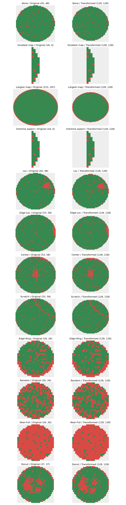

# WM-811K 변환·패턴 보존 검사

상태: `transform_check_passed`

Train/Validation 전체 대상의 기계적 검사입니다. Test 맵은 읽지 않았습니다.

| 구간 | 클래스 | 검사 수 | 불량 전체 소실 | 유효 영역 소실 | 평균 불량 비율 절대 변화 |
| --- | --- | ---: | ---: | ---: | ---: |
| train | Center | 3144 | 0 | 0 | 0.001959 |
| train | Donut | 439 | 0 | 0 | 0.001759 |
| train | Edge-Loc | 3653 | 0 | 0 | 0.001480 |
| train | Edge-Ring | 7685 | 0 | 0 | 0.001241 |
| train | Loc | 2811 | 0 | 0 | 0.001406 |
| train | Near-Full | 113 | 0 | 0 | 0.001192 |
| train | None | 101768 | 0 | 0 | 0.001266 |
| train | Random | 688 | 0 | 0 | 0.002110 |
| train | Scratch | 960 | 0 | 0 | 0.001291 |
| validation | Center | 573 | 0 | 0 | 0.001733 |
| validation | Donut | 58 | 0 | 0 | 0.001521 |
| validation | Edge-Loc | 764 | 0 | 0 | 0.001344 |
| validation | Edge-Ring | 997 | 0 | 0 | 0.001367 |
| validation | Loc | 390 | 0 | 0 | 0.001083 |
| validation | Near-Full | 18 | 0 | 0 | 0.001486 |
| validation | None | 22821 | 0 | 0 | 0.001253 |
| validation | Random | 89 | 0 | 0 | 0.001780 |
| validation | Scratch | 117 | 0 | 0 | 0.001378 |

비율 차이 0.01은 1%p 차이입니다. 픽셀 수가 달라지므로 다이 개수의 동일성을 요구하지 않습니다.
불량·유효 영역 전체 소실이 한 건이라도 있으면 검토 필요입니다. 자동 해상도 변경은 하지 않습니다.
통과해도 가는 선·고리·국소 결함의 형태 보존을 보장하지 않습니다. 아래 원본/변환 그림을 직접 검토하세요.

클래스별 첫 사례와 작은 맵·큰 맵·극단 종횡비 사례입니다. 대표 표본이 아니며 Test 예시는 포함하지 않습니다.
변환 캐시·Dataset·모델은 생성하지 않았습니다. 학습 준비 완료나 모델 성능 평가 결과가 아닙니다.
집계·그림·행별 결과는 로컬 전용입니다. 에이전트의 외부 LLM·추적 서비스에 보내지 마세요.
